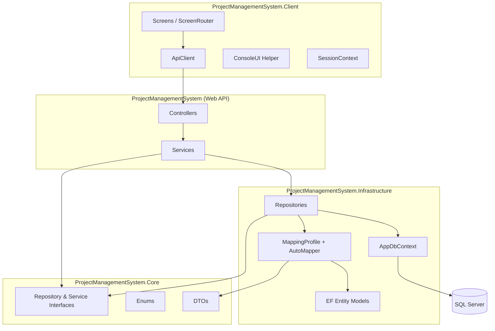
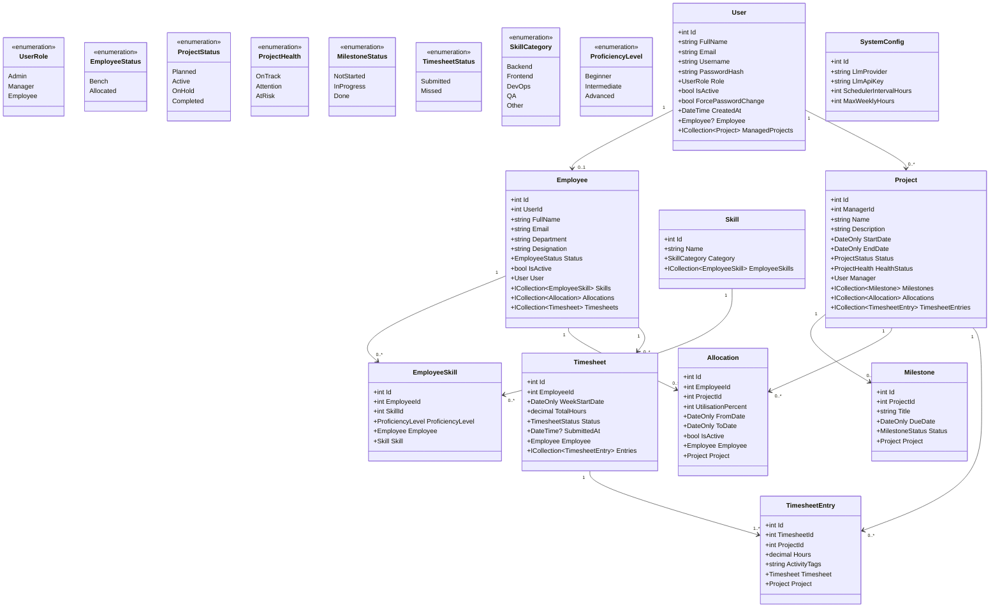

# PRM Tool � Class Diagram

> Rendered with [Mermaid](https://mermaid.js.org/). View in GitHub, VS Code (Markdown Preview Mermaid Support), or [mermaid.live](https://mermaid.live).

---

## 0. Solution Architecture



| Project | Responsibility |
|---|---|
| `ProjectManagementSystem.Client` | Console UI, JWT session, HTTP calls via `ApiClient` |
| `ProjectManagementSystem` | ASP.NET Core Web API � controllers & business services |
| `ProjectManagementSystem.Core` | DTOs, enums, interfaces (no EF dependencies) |
| `ProjectManagementSystem.Infrastructure` | EF Core models, repositories, AutoMapper profiles, migrations |

---

## 1. Domain Models (`Infrastructure/Models/`) & Enums (`Core/Enums/`)



---

## 2. AutoMapper Layer (`Infrastructure/Mapping/`)

```mermaid
classDiagram

    class MappingProfile {
        <<Profile>>
        +MappingProfile()
    }

    class IMapper {
        <<interface>>
        +Map~TDest~(source) TDest
        +Map~TDest~(source, dest) TDest
    }

    class UserRepository {
        -AppDbContext db
        -IMapper mapper
    }

    class EmployeeRepository {
        -AppDbContext db
        -IMapper mapper
    }

    class ProjectRepository {
        -AppDbContext db
        -IMapper mapper
    }

    class AllocationRepository {
        -AppDbContext db
        -IMapper mapper
    }

    class SkillRepository {
        -AppDbContext db
        -IMapper mapper
    }

    class TimesheetRepository {
        -AppDbContext db
        -IMapper mapper
    }

    class SystemConfigRepository {
        -AppDbContext db
        -IMapper mapper
    }

    MappingProfile ..> User : Entity to DTO
    MappingProfile ..> Employee : Entity to DTO
    MappingProfile ..> Project : Entity to DTO
    MappingProfile ..> Milestone : Entity to DTO
    MappingProfile ..> Allocation : Entity to DTO
    MappingProfile ..> EmployeeSkill : Entity to DTO
    MappingProfile ..> SystemConfig : Entity to DTO
    MappingProfile ..> Timesheet : Entity to DTO

    UserRepository --> IMapper : uses
    EmployeeRepository --> IMapper : uses
    ProjectRepository --> IMapper : uses
    AllocationRepository --> IMapper : uses
    SkillRepository --> IMapper : uses
    TimesheetRepository --> IMapper : uses
    SystemConfigRepository --> IMapper : uses
```



**Registered in `Program.cs`:**

```csharp
builder.Services.AddAutoMapper(typeof(MappingProfile).Assembly);
```

**Key mappings:** enum-to-string for DTOs, navigation properties (`ManagerName`, `EmployeeName`, `ProjectName`, `SkillName`), `Create*Dto` ? entity with ignored navigations and defaults.

---

## 3. Repository Layer (`Infrastructure/Repositories/`)

Repositories return **DTOs** (not raw entities) via AutoMapper.

```mermaid
classDiagram

    class IUserRepository {
        <<interface>>
        +GetByIdAsync(id) Task~UserDto~
        +GetByUsernameAsync(username) Task~User~
        +GetAllAsync() Task~IEnumerable~UserDto~~
        +CreateAsync(dto) Task~UserDto~
        +UpdateAsync(user) Task
        +ExistsAsync(username, email) Task~bool~
    }

    class IEmployeeRepository {
        <<interface>>
        +GetByIdAsync(id) Task~EmployeeDto~
        +GetAllAsync() Task~IEnumerable~EmployeeDto~~
        +GetByUserIdAsync(userId) Task~EmployeeDto~
        +CreateAsync(dto) Task~EmployeeDto~
        +UpdateAsync(id, dto) Task~EmployeeDto~
        +DeactivateAsync(id) Task
        +SetStatusAsync(id, status) Task
    }

    class IProjectRepository {
        <<interface>>
        +GetByIdAsync(id) Task~ProjectDto~
        +GetAllAsync() Task~IEnumerable~ProjectDto~~
        +GetByManagerIdAsync(managerId) Task~IEnumerable~ProjectDto~~
        +GetWithMilestonesAsync(id) Task~Project~
        +CreateAsync(dto) Task~ProjectDto~
        +UpdateAsync(id, dto) Task
        +UpdateHealthStatusAsync(id, health) Task
        +GetActiveAsync() Task~IEnumerable~Project~~
    }

    class IAllocationRepository {
        <<interface>>
        +GetAllActiveAsync() Task~IEnumerable~AllocationDto~~
        +GetByEmployeeIdAsync(employeeId) Task~IEnumerable~AllocationDto~~
        +GetByProjectIdAsync(projectId) Task~IEnumerable~AllocationDto~~
        +GetByIdAsync(id) Task~AllocationDto~
        +CreateAsync(dto) Task~AllocationDto~
        +UpdateEndDateAsync(id, endDate) Task~AllocationDto~
        +GetEmployeeIdsAllocatedBetweenAsync(from, to) Task~IEnumerable~int~~
    }

    class ITimesheetRepository {
        <<interface>>
        +GetByIdAsync(id) Task~TimesheetDto~
        +GetByEmployeeIdAsync(employeeId) Task~IEnumerable~TimesheetDto~~
        +GetTeamTimesheetsAsync(managerId, weekStart) Task~IEnumerable~TimesheetDto~~
        +ExistsForEmployeeWeekAsync(employeeId, weekStart) Task~bool~
        +CreateAsync(timesheet) Task~TimesheetDto~
        +CreateMissedAsync(employeeId, weekStart) Task
    }

    class ISkillRepository {
        <<interface>>
        +GetSkillsByEmployeeAsync(employeeId) Task~IEnumerable~EmployeeSkillDto~~
        +AddSkillAsync(employeeId, dto) Task~EmployeeSkillDto~
        +UpdateSkillAsync(employeeId, skillId, dto) Task
        +RemoveSkillAsync(employeeId, skillId) Task
    }

    class ISystemConfigRepository {
        <<interface>>
        +GetAsync() Task~SystemConfigDto~
        +UpdateAsync(dto) Task
    }

    class UserRepository {
        -AppDbContext db
        -IMapper mapper
    }

    class EmployeeRepository {
        -AppDbContext db
        -IMapper mapper
    }

    class ProjectRepository {
        -AppDbContext db
        -IMapper mapper
    }

    class AllocationRepository {
        -AppDbContext db
        -IMapper mapper
    }

    class TimesheetRepository {
        -AppDbContext db
        -IMapper mapper
    }

    class SkillRepository {
        -AppDbContext db
        -IMapper mapper
    }

    class SystemConfigRepository {
        -AppDbContext db
        -IMapper mapper
    }

    IUserRepository <|.. UserRepository
    IEmployeeRepository <|.. EmployeeRepository
    IProjectRepository <|.. ProjectRepository
    IAllocationRepository <|.. AllocationRepository
    ITimesheetRepository <|.. TimesheetRepository
    ISkillRepository <|.. SkillRepository
    ISystemConfigRepository <|.. SystemConfigRepository
```



---

## 4. Service Layer (`ProjectManagementSystem/Services/`)

```mermaid
classDiagram

    class IAuthService {
        <<interface>>
        +LoginAsync(request) Task~LoginResponseDto~
        +SignUpAsync(request) Task~UserDto~
        +ChangePasswordAsync(userId, dto) Task
    }

    class IUserService {
        <<interface>>
        +GetAllAsync() Task~IEnumerable~UserDto~~
        +CreateAsync(dto) Task~UserDto~
        +ResetPasswordAsync(userId, dto) Task
        +DeactivateAsync(userId) Task
        +ReactivateAsync(userId) Task
    }

    class IEmployeeService {
        <<interface>>
        +GetAllAsync() Task~IEnumerable~EmployeeDto~~
        +CreateAsync(dto) Task~EmployeeDto~
        +UpdateAsync(id, dto) Task
        +DeactivateAsync(id) Task
    }

    class IProjectService {
        <<interface>>
        +GetAllAsync() Task~IEnumerable~ProjectDto~~
        +GetByIdAsync(id) Task~ProjectDto~
        +CreateAsync(dto) Task~ProjectDto~
        +UpdateAsync(id, dto) Task
        +GetMilestonesAsync(projectId) Task~IEnumerable~MilestoneDto~~
        +AddMilestoneAsync(projectId, dto) Task
        +UpdateMilestoneStatusAsync(projectId, milestoneId, dto) Task
    }

    class IAllocationService {
        <<interface>>
        +GetAllActiveAsync() Task~IEnumerable~AllocationDto~~
        +GetByProjectIdAsync(projectId) Task~IEnumerable~AllocationDto~~
        +GetByIdAsync(id) Task~AllocationDto~
        +CreateAsync(dto) Task~AllocationDto~
        +EndAsync(id, endDate) Task
    }

    class ITimesheetService {
        <<interface>>
        +GetTeamTimesheetsAsync(managerId, weekStart) Task~ManagerTeamTimesheetDto~
        +GetTimesheetByIdAsync(id) Task~TimesheetDto~
    }

    class IManagerService {
        <<interface>>
        +GetResourceDashboardAsync() Task~ResourceDashboardDto~
        +GetEmployeeDetailAsync(id) Task~EmployeeDetailDto~
        +GetMyProjectsAsync(managerId) Task~IEnumerable~ProjectDto~~
        +GetProjectDetailAsync(managerId, projectId) Task~ProjectDetailDto~
        +GetAISkillMatchAsync(request) Task~AISkillMatchResultDto~
        +GetAIRiskSummaryAsync(request) Task~AIRiskSummaryResultDto~
    }

    class IEmployeePortalService {
        <<interface>>
        +GetReminderAsync(userId) Task~EmployeeReminderDto~
        +GetProfileAsync(userId) Task~EmployeeProfileDto~
        +GetSubmitContextAsync(userId, weekStart) Task~EmployeeSubmitContextDto~
        +SubmitTimesheetAsync(userId, dto) Task~TimesheetDto~
        +GetMyTimesheetsAsync(userId) Task~IEnumerable~TimesheetDto~~
        +GetMyTimesheetAsync(userId, id) Task~TimesheetDto~
    }

    class ISchedulerService {
        <<interface>>
        +RunScheduledTasksAsync(ct) Task
    }

    class ManagerService {
        -IEmployeeRepository employeeRepo
        -IAllocationRepository allocationRepo
        -IProjectRepository projectRepo
        -ISkillRepository skillRepo
        -ITimesheetRepository timesheetRepo
        -ISystemConfigRepository configRepo
        +ComputeDisplayHealth() ProjectHealth
    }

    class EmployeePortalService {
        -IEmployeeRepository employeeRepo
        -IAllocationRepository allocationRepo
        -ITimesheetRepository timesheetRepo
        -ISystemConfigRepository configRepo
    }

    class SchedulerService {
        -IEmployeeRepository employeeRepo
        -IProjectRepository projectRepo
        -ITimesheetRepository timesheetRepo
        -IAllocationRepository allocationRepo
    }

    class SchedulerHostedService {
        -IServiceScopeFactory scopeFactory
        +ExecuteAsync(stoppingToken) Task
    }

    IManagerService <|.. ManagerService
    IEmployeePortalService <|.. EmployeePortalService
    ISchedulerService <|.. SchedulerService
    SchedulerHostedService --> ISchedulerService : invokes via scope
```



---

## 5. API Controllers

```mermaid
classDiagram

    class AuthController {
        +POST /api/auth/login
        +POST /api/auth/signup
        +PUT /api/auth/change-password
    }

    class UsersController {
        <<Authorize Admin>>
        +GET/POST /api/users
        +PUT reset-password, deactivate, reactivate
    }

    class EmployeesController {
        <<Authorize Admin>>
        +GET/POST /api/employees
        +PUT/DELETE skills
    }

    class ProjectsController {
        <<Authorize Admin>>
        +GET/POST /api/projects
        +milestones CRUD
    }

    class AllocationsController {
        <<Authorize Admin>>
        +GET /api/allocations
    }

    class ConfigController {
        <<Authorize Admin>>
        +GET/PUT /api/config
    }

    class ManagerController {
        <<Authorize Manager>>
        +GET /api/manager/dashboard
        +GET /api/manager/projects
        +GET /api/manager/projects/id/detail
        +POST /api/manager/allocations
        +PUT /api/manager/allocations/id/end
        +GET /api/manager/timesheets
        +POST /api/manager/ai/skill-match
        +POST /api/manager/ai/risk-summary
    }

    class EmployeeController {
        <<Authorize Employee>>
        +GET /api/employee/reminder
        +GET /api/employee/allocations
        +GET /api/employee/timesheets/context
        +POST /api/employee/timesheets
        +GET /api/employee/timesheets
    }

    ManagerController --> IManagerService
    ManagerController --> IAllocationService
    ManagerController --> IProjectService
    ManagerController --> ITimesheetService
    EmployeeController --> IEmployeePortalService
```



> **Note:** AI uses the **Strategy + Factory** adapter pattern (`IAiProvider` → Gemini/Groq). When no API key is configured, `AiService` falls back to rule-based matching. Configure via Admin → System Configuration.

---

## 6. Console Client � Screen Hierarchy (`ProjectManagementSystem.Client/`)

```mermaid
classDiagram

    class ApiClient {
        +LoginAsync()
        +SignUpAsync()
        +Admin* methods
        +Manager* methods
        +Employee* methods
    }

    class SessionContext {
        +string JwtToken
        +int UserId
        +string FullName
        +string Role
        +bool ForcePasswordChange
        +bool IsLoggedIn
    }

    class ScreenRouter {
        +RouteAsync() Task
    }

    class ConsoleUI {
        +DrawBox()
        +Menu()
        +SubHeader()
        +HealthIcon()
        +RiskFlag()
    }

    class StartScreen {
        +ShowAsync() Task
        -HandleLoginAsync()
    }

    class SignUpScreen
    class ChangePasswordScreen
    class AdminMenuScreen
    class ManagerMenuScreen
    class EmployeeMenuScreen

    class ManageEmployeesScreen
    class ManageProjectsScreen
    class ViewAllocationsScreen
    class ManageUsersScreen
    class SystemConfigScreen
    class ManageSkillsScreen

    class ResourceDashboardScreen
    class AllocateResourceScreen
    class MyProjectsScreen
    class TimesheetManagerScreen
    class AiAssistantScreen

    class SubmitTimesheetScreen
    class ViewTimesheetsScreen
    class ViewMyAllocationsScreen

    StartScreen --> ApiClient
    ScreenRouter --> AdminMenuScreen
    ScreenRouter --> ManagerMenuScreen
    ScreenRouter --> EmployeeMenuScreen

    AdminMenuScreen --> ManageEmployeesScreen
    AdminMenuScreen --> ManageProjectsScreen
    AdminMenuScreen --> ViewAllocationsScreen
    AdminMenuScreen --> ManageUsersScreen
    AdminMenuScreen --> SystemConfigScreen

    ManagerMenuScreen --> ResourceDashboardScreen
    ManagerMenuScreen --> AllocateResourceScreen
    ManagerMenuScreen --> MyProjectsScreen
    ManagerMenuScreen --> TimesheetManagerScreen
    ManagerMenuScreen --> AiAssistantScreen

    EmployeeMenuScreen --> SubmitTimesheetScreen
    EmployeeMenuScreen --> ViewTimesheetsScreen
    EmployeeMenuScreen --> ViewMyAllocationsScreen

    StartScreen --> SessionContext
    ScreenRouter --> SessionContext
```


