# PRM Tool � Flow Diagrams

> Rendered with [Mermaid](https://mermaid.js.org/). View in GitHub, VS Code (Markdown Preview Mermaid Support), or [mermaid.live](https://mermaid.live).

---

## Table of Contents

1. [Application Startup & Login Flow](#1-application-startup--login-flow)
2. [Role-Based Navigation Flow](#2-role-based-navigation-flow)
3. [Admin � Full Feature Flow](#3-admin--full-feature-flow)
4. [Manager � Full Feature Flow](#4-manager--full-feature-flow)
5. [Employee � Full Feature Flow](#5-employee--full-feature-flow)
6. [Allocation Validation Flow](#6-allocation-validation-flow)
7. [Timesheet Submission Validation Flow](#7-timesheet-submission-validation-flow)
8. [AI Skill Match Flow](#8-ai-skill-match-flow)
9. [AI Risk Summary Flow](#9-ai-risk-summary-flow)
10. [Background Scheduler Flow](#10-background-scheduler-flow)
11. [Employee Deactivation Flow](#11-employee-deactivation-flow)
12. [Password Policy & Reset Flow](#12-password-policy--reset-flow)
13. [Entity to DTO Mapping Flow (AutoMapper)](#13-entity-to-dto-mapping-flow-automapper)

---

## 1. Application Startup & Login Flow

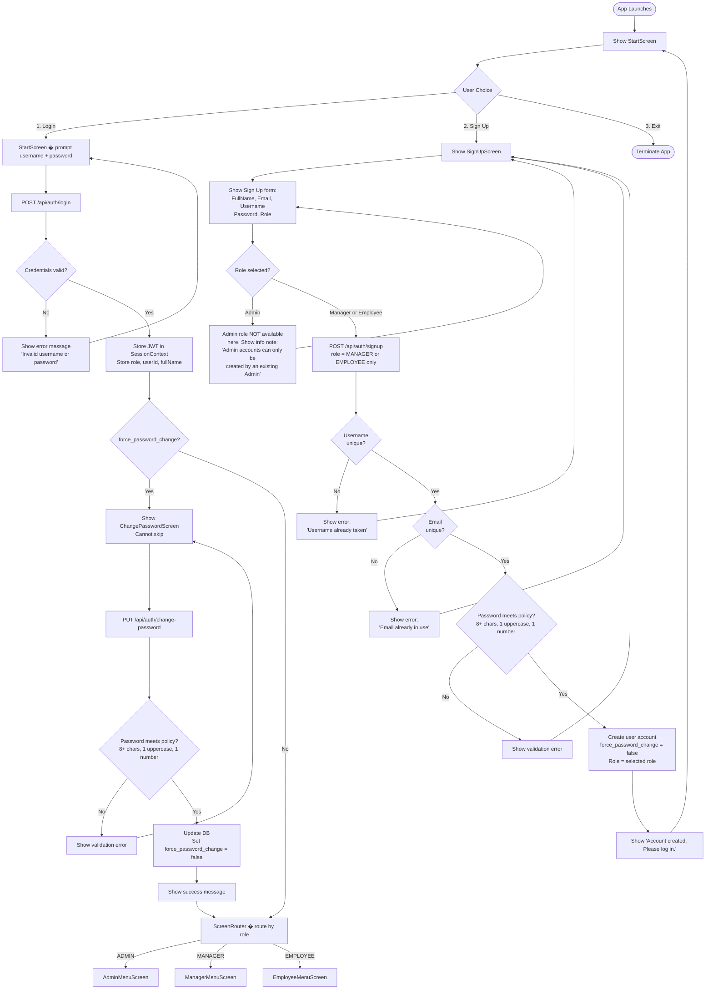

---

## 2. Role-Based Navigation Flow

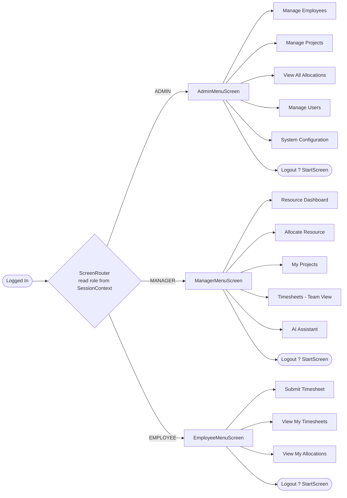

---

## 3. Admin � Full Feature Flow

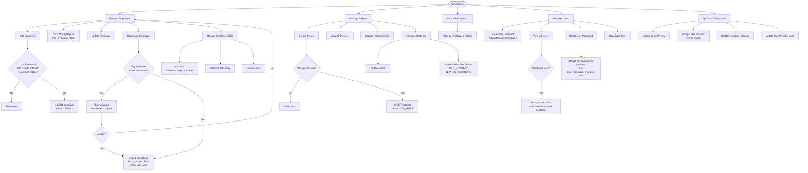

---

## 4. Manager � Full Feature Flow

```mermaid
flowchart TD
    MM([Manager Menu]) --> M1 & M2 & M3 & M4 & M5

    %% ?? Resource Dashboard ??
    M1[Resource Dashboard] --> M1a[Show ON BENCH employees\nwith skills]
    M1 --> M1b[Show ACTIVE employees\nwith utilisation %]
    M1a & M1b --> M1d{Drill into employee?}
    M1d -->|D + Employee ID| M1e[Show:\n- Profile skills\n- Active allocations\n- Recent activity tags last 4 wks]

    %% ?? Allocate Resource ??
    M2[Allocate Resource] --> M2a[AI-Assisted Search]
    M2 --> M2b[Direct Allocation]
    M2 --> M2c[End an Allocation]

    M2a --> M2a1[Select Project]
    M2a1 --> M2a2[Type natural language requirement]
    M2a2 --> M2a3[POST /api/manager/ai/skill-match]
    M2a3 --> M2a4[Show AI-ranked results\nwith reasons]
    M2a4 --> M2a5{Select employee\nor search again?}
    M2a5 -->|0 - search again| M2a2
    M2a5 -->|Select #N| M2a6[Set Utilisation%, From, To]
    M2a6 --> AllocValidation[(Allocation Validation\nFlow � see �6)]
    AllocValidation --> M2Saved[Allocation saved ?]

    M2b --> M2b1[Select Project + Employee ID]
    M2b1 --> M2b2[Set Utilisation%, From, To]
    M2b2 --> AllocValidation

    M2c --> M2c1[Select Project]
    M2c1 --> M2c2[Show active allocations on project]
    M2c2 --> M2c3[Select allocation to end]
    M2c3 --> M2c4{Confirm end?}
    M2c4 -->|No| M2c2
    M2c4 -->|Yes| M2c5[Set to_date = today\nSet is_active = false]
    M2c5 --> M2c6{Any other active\nallocations for employee?}
    M2c6 -->|No| M2c7[Set employee status = BENCH]
    M2c6 -->|Yes| M2c8[Keep status = ALLOCATED]

    %% ?? My Projects ??
    M3[My Projects] --> M3a[List projects with\n?? AT_RISK  ?? ATTENTION  ?? ON_TRACK\n(computed live via ManagerService)]
    M3a --> M3b[Select project ? Project Detail\nGET /api/manager/projects/id/detail]
    M3b --> M3c[Show milestones + allocations\n+ risk flags]
    M3c --> M3d{Get AI Risk Summary?}
    M3d -->|A| M3e[POST /api/manager/ai/risk-summary]
    M3e --> M3f[Display plain-English paragraph]

    %% ?? Timesheets ??
    M4[Timesheets - Team View] --> M4a[Filter by week\ndefault = current week\nGET /api/manager/timesheets]
    M4a --> M4b[Show team timesheet status\nSUBMITTED / MISSED]
    M4b --> M4c{View detail?}
    M4c -->|V + Employee| M4d[Show hours per project\n+ activity tags read-only]

    %% ?? AI Assistant ??
    M5[AI Assistant] --> M5a[Skill Match\nNatural language search]
    M5 --> M5b[Risk Summary\nSelect project]
    M5a --> M5aGo{Go to Allocate?}
    M5aGo -->|A| M2
```

---

## 5. Employee � Full Feature Flow

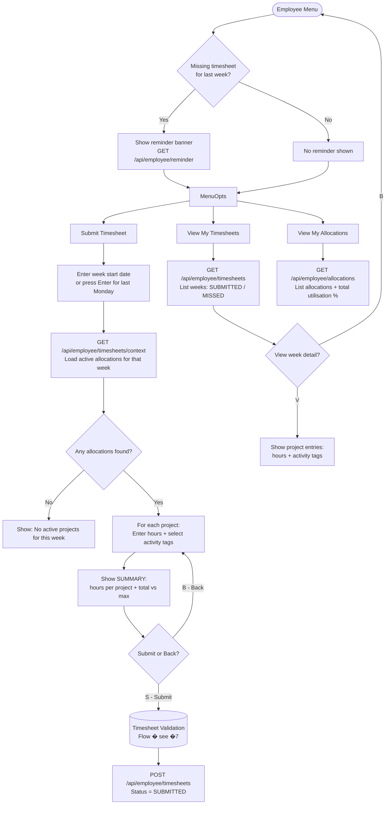

---

## 6. Allocation Validation Flow

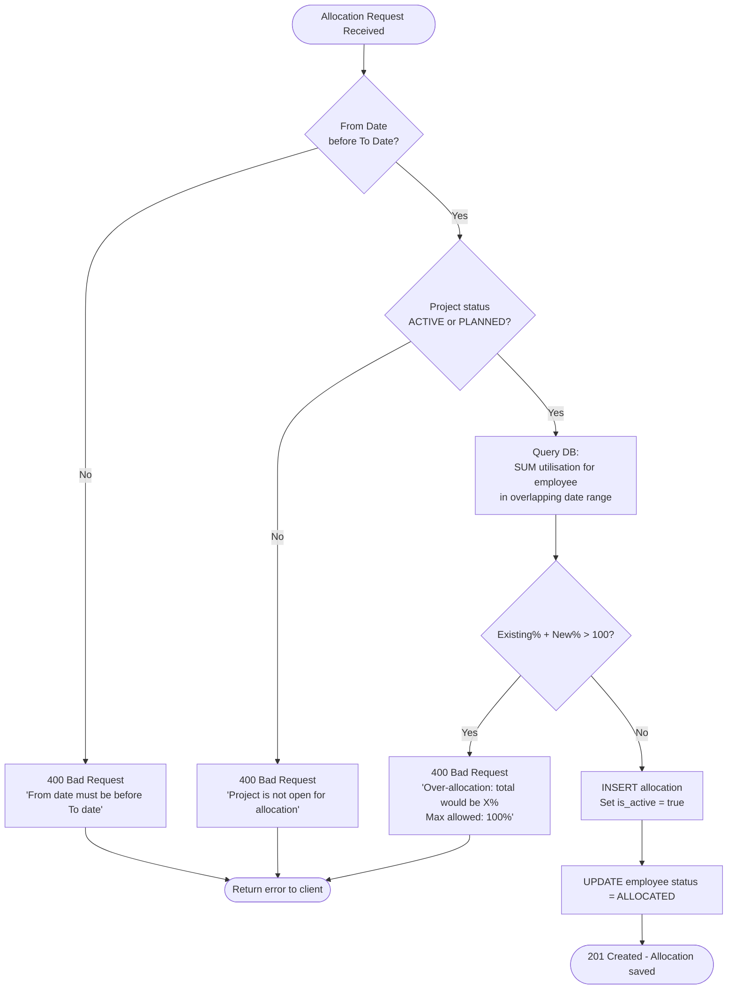

---

## 7. Timesheet Submission Validation Flow

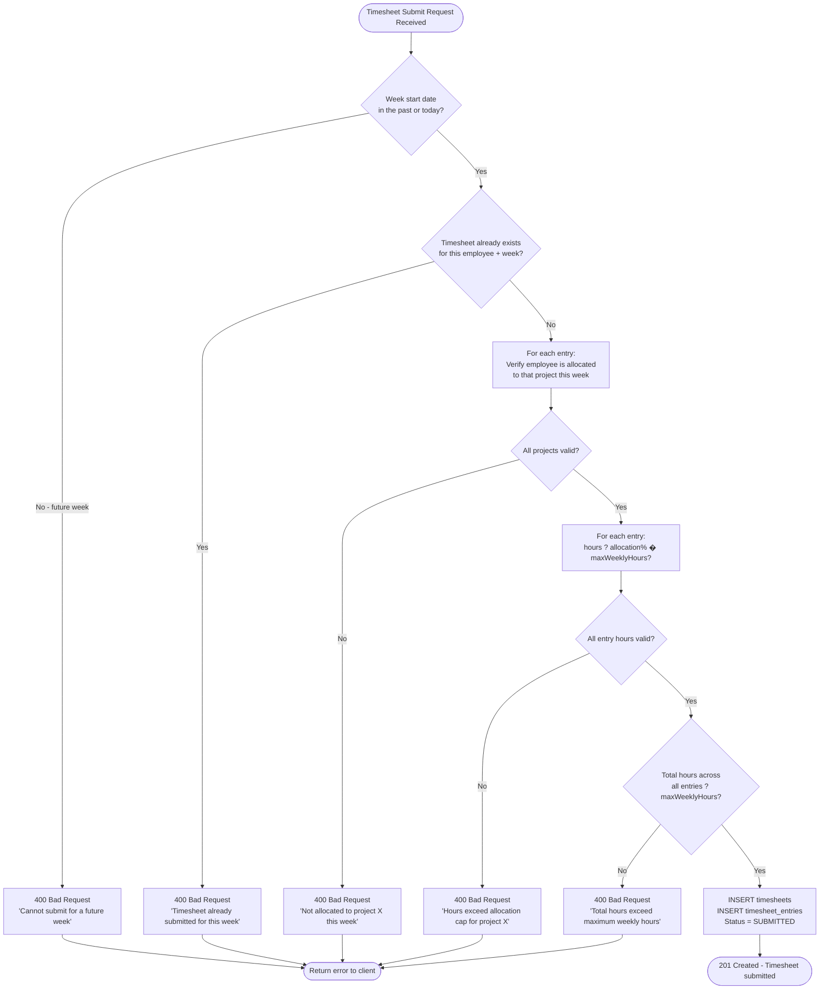

---

## 8. AI Skill Match Flow

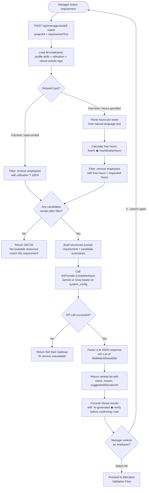

---

## 9. AI Risk Summary Flow

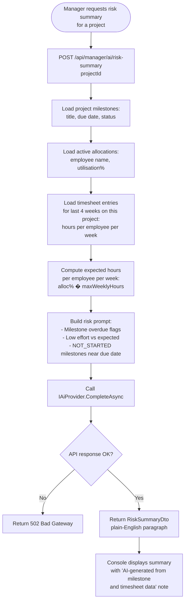

---

## 10. Background Scheduler Flow

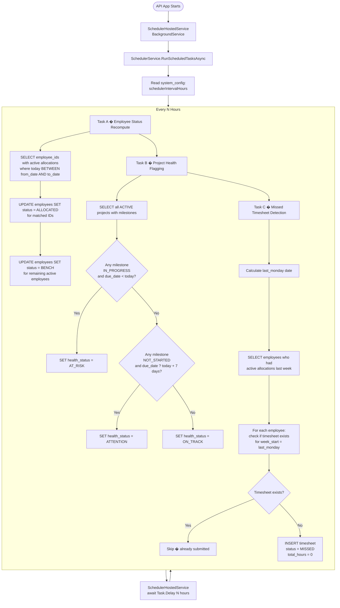

---

## 11. Employee Deactivation Flow

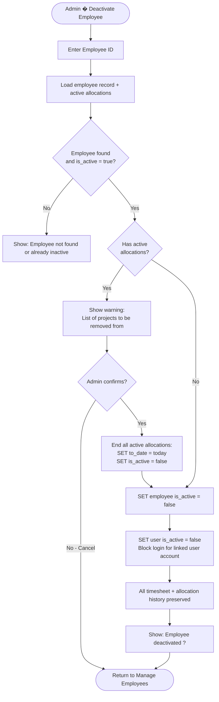

---

## 12. Password Policy & Reset Flow

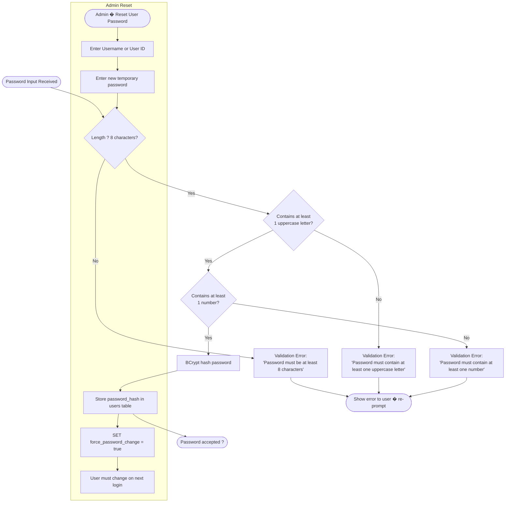

---

## 13. Entity to DTO Mapping Flow (AutoMapper)

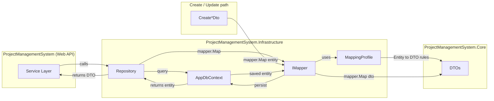

**Registered once at startup:** `builder.Services.AddAutoMapper(typeof(MappingProfile).Assembly);`

**Repositories using AutoMapper:** `UserRepository`, `EmployeeRepository`, `ProjectRepository`, `AllocationRepository`, `SkillRepository`, `TimesheetRepository`, `SystemConfigRepository`

---

## 13. Entity to DTO Mapping Flow (AutoMapper)

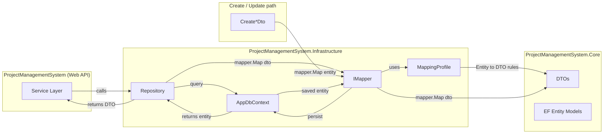

**Registered once at startup:** `builder.Services.AddAutoMapper(typeof(MappingProfile).Assembly);`

**Repositories using AutoMapper:** `UserRepository`, `EmployeeRepository`, `ProjectRepository`, `AllocationRepository`, `SkillRepository`, `TimesheetRepository`, `SystemConfigRepository`
