# PRM Tool � Sequence Diagrams

> Rendered with [Mermaid](https://mermaid.js.org/). View in GitHub, VS Code (Markdown Preview Mermaid Support), or [mermaid.live](https://mermaid.live).

---

## Table of Contents

1. [Login & Force Password Change](#1-login--force-password-change)
2. [Sign Up (Self-Registration)](#2-sign-up-self-registration)
3. [Admin � Create User + Add Employee](#3-admin--create-user--add-employee)
4. [Admin � Manage Employee Skills](#4-admin--manage-employee-skills)
5. [Admin � Create Project & Add Milestone](#5-admin--create-project--add-milestone)
6. [Manager � AI-Assisted Resource Allocation](#6-manager--ai-assisted-resource-allocation)
7. [Manager � Direct Allocation](#7-manager--direct-allocation)
8. [Manager � End an Allocation](#8-manager--end-an-allocation)
9. [Manager � View Project Health + AI Risk Summary](#9-manager--view-project-health--ai-risk-summary)
10. [Employee � Submit Timesheet](#10-employee--submit-timesheet)
11. [Background Scheduler � Auto Tasks](#11-background-scheduler--auto-tasks)
12. [Admin � System Configuration Update](#12-admin--system-configuration-update)
13. [Repository � Entity to DTO Mapping (AutoMapper)](#13-repository--entity-to-dto-mapping-automapper)

---

## 1. Login & Force Password Change

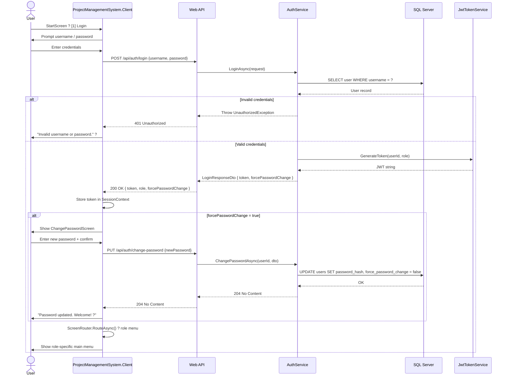

---

## 2. Sign Up (Self-Registration)

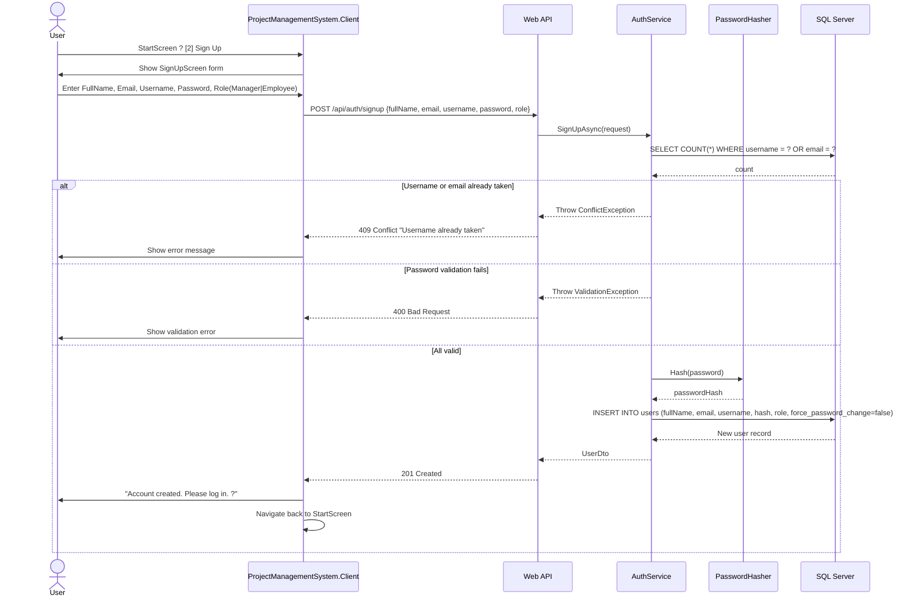

---

## 3. Admin � Create User + Add Employee

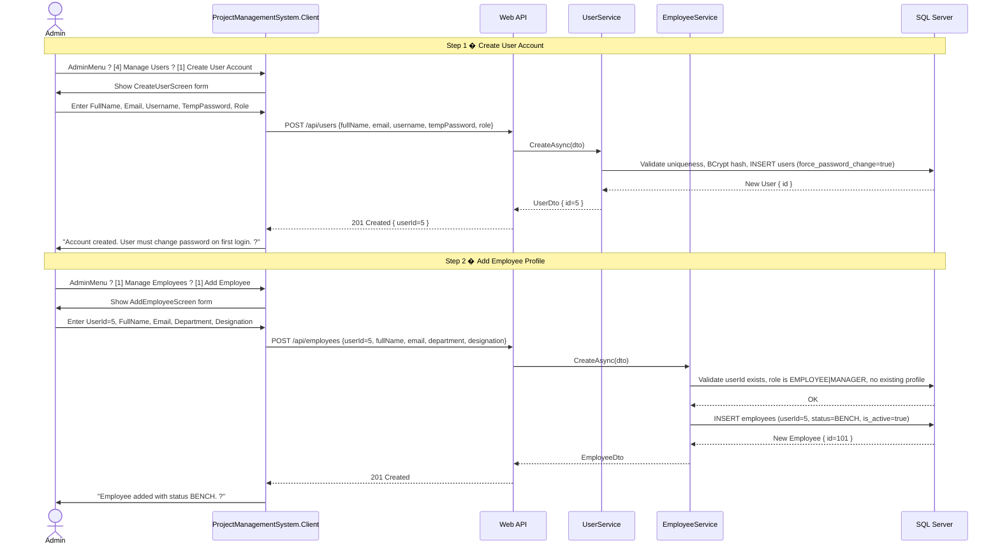

---

## 4. Admin � Manage Employee Skills

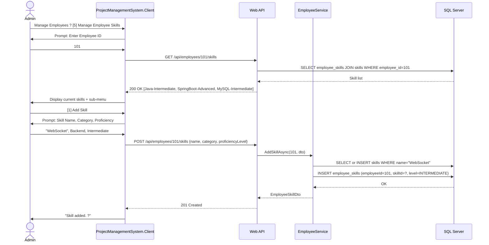

---

## 5. Admin � Create Project & Add Milestone

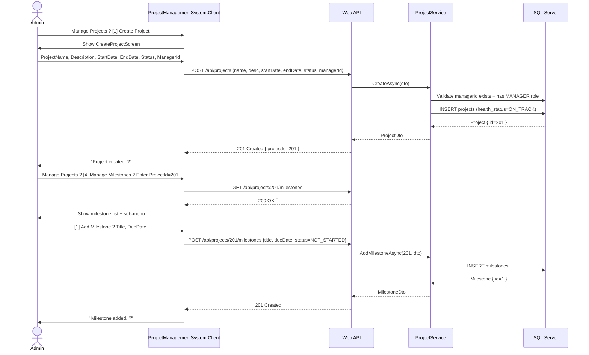

---

## 6. Manager � AI-Assisted Resource Allocation

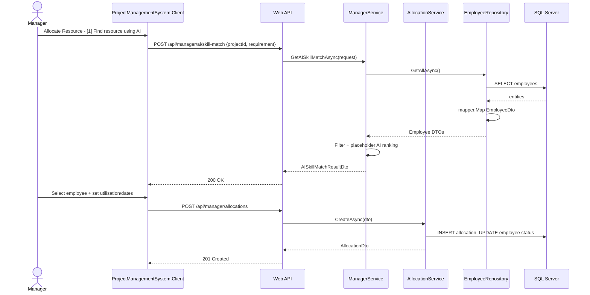

---

## 7. Manager � Direct Allocation

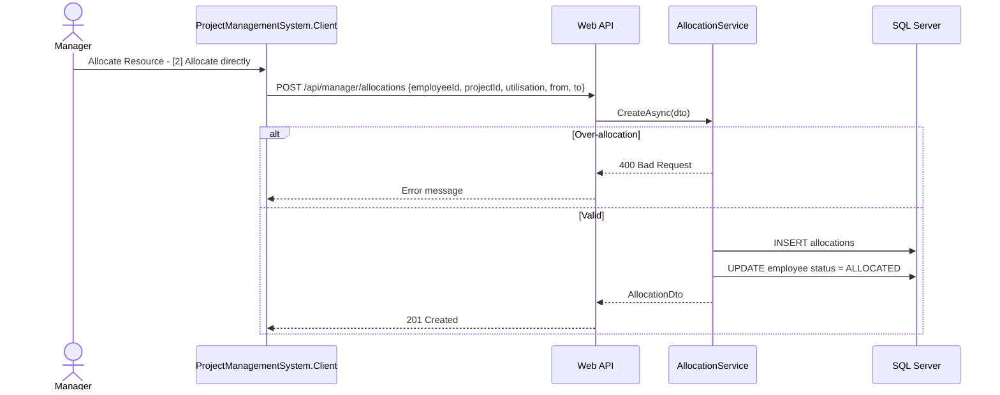

---

## 8. Manager � End an Allocation

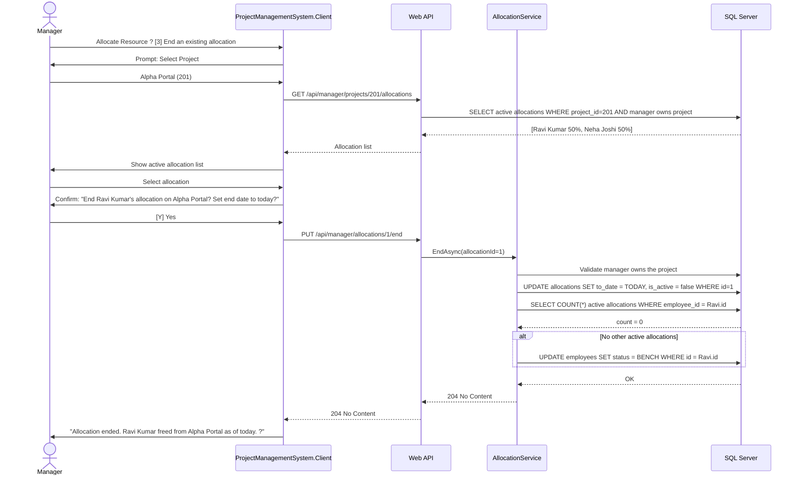

---

## 9. Manager � View Project Health + AI Risk Summary

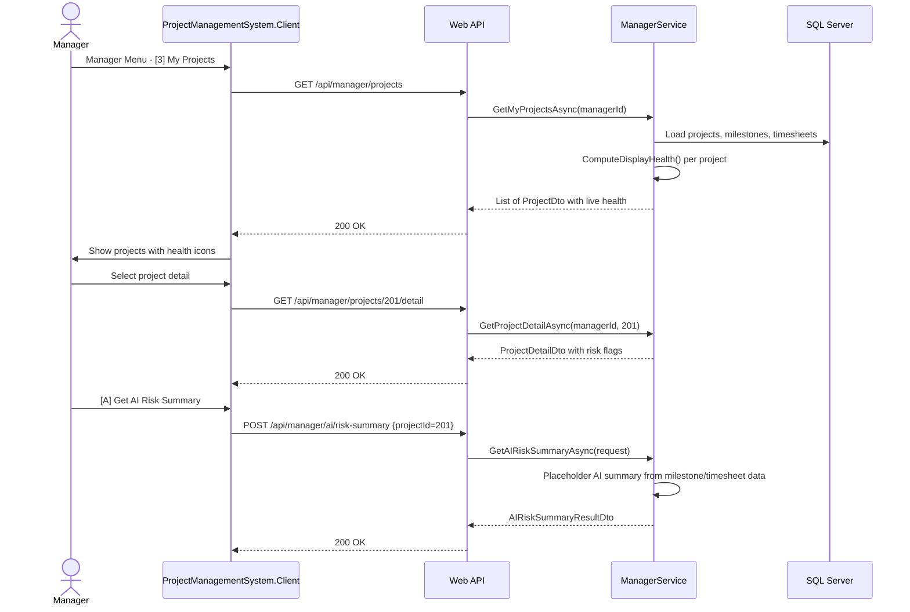

---

## 10. Employee � Submit Timesheet

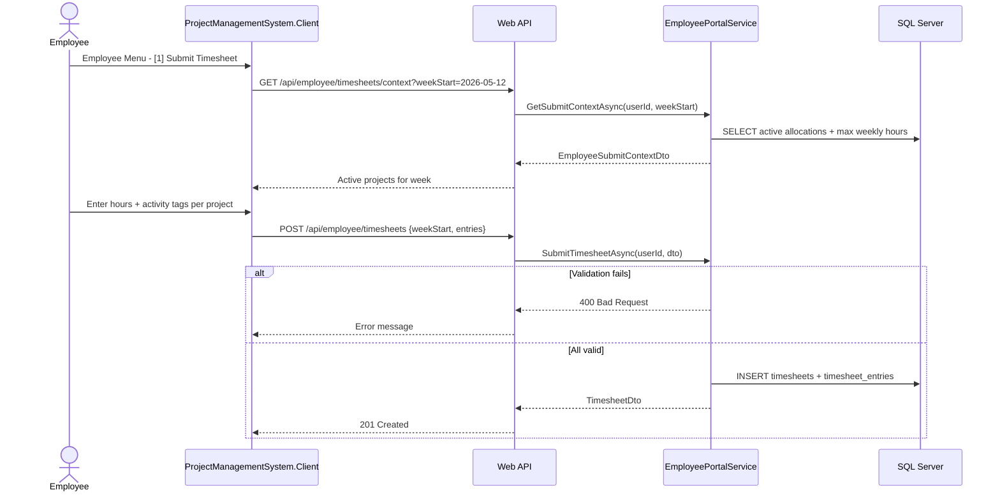

---

## 11. Background Scheduler � Auto Tasks

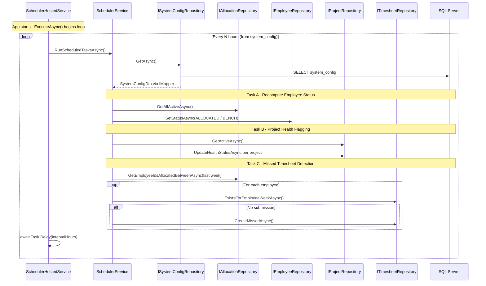

---

## 12. Admin � System Configuration Update

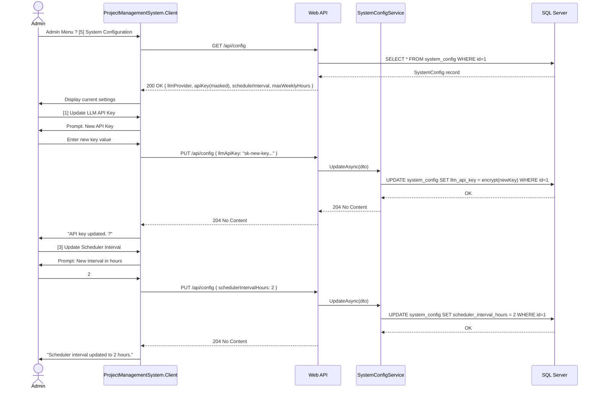

---

## 13. Repository � Entity to DTO Mapping (AutoMapper)

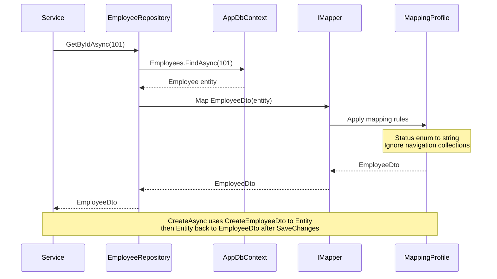

**DI registration:** `builder.Services.AddAutoMapper(typeof(MappingProfile).Assembly);`
