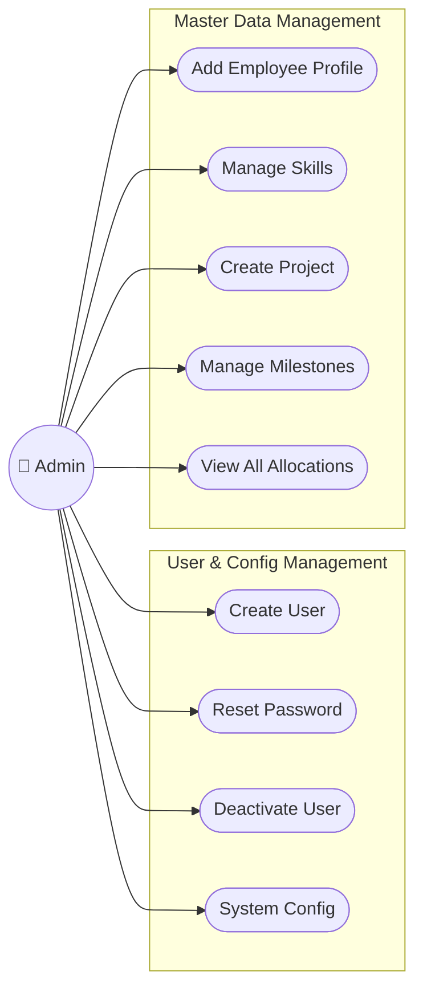
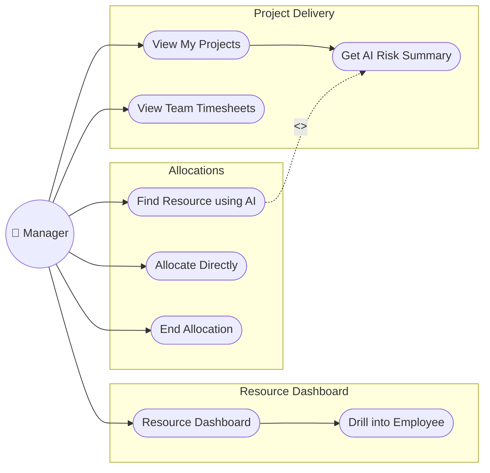
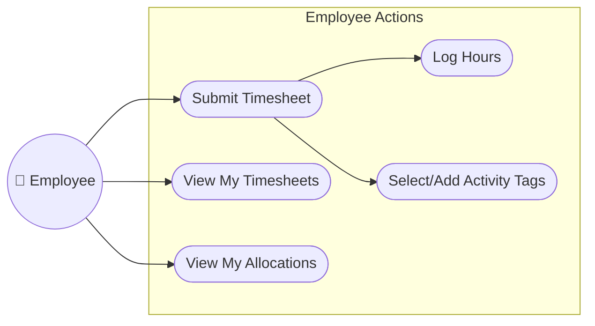
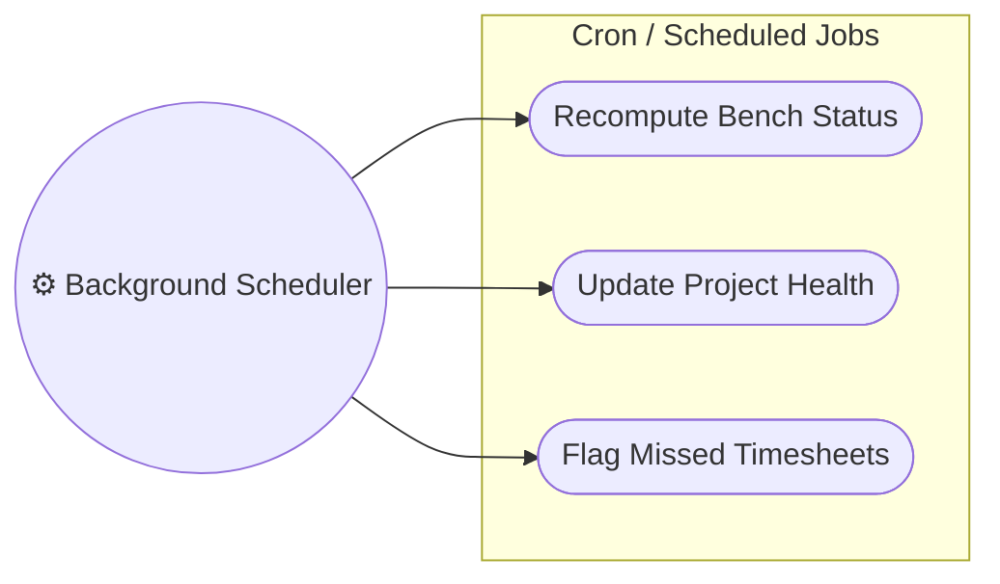

# PRM Tool — Use Case Diagram

> Rendered with [Mermaid](https://mermaid.js.org/). View in GitHub, VS Code (Markdown Preview Mermaid Support), or [mermaid.live](https://mermaid.live).

---

## 1. System Overview & Actors

The **Project & Resource Management (PRM) System** is a client-server application designed to streamline resource planning, project milestone tracking, timesheet management, and AI-driven skill matching/risk analysis.

The system defines four primary actors:
1. **Admin (System Operator)**: Manages core system data, users, employees, projects, and global configuration.
2. **Manager (Delivery Manager)**: Searches and allocates resources (directly or using AI), tracks project health, and reviews team timesheets.
3. **Employee (Individual Contributor)**: Views active allocations, submits weekly timesheets with activity tags, and views historical timesheets.
4. **Background Scheduler (System Actor)**: Automatically executes periodic updates to recompute resource utilization, project health, and flag missed timesheets.

---

## 2. Main Use Case Diagram

The diagram below maps all actor-to-system interactions and use-case boundaries.

```mermaid
flowchart TB
    %% Actors
    Admin((👤 Admin))
    Manager((👤 Manager))
    Employee((👤 Employee))
    Scheduler((⚙️ Background Scheduler))

    subgraph PRM["Project & Resource Management (PRM) System"]
        
        %% Core Auth Use Cases
        subgraph Auth["Authentication & Session"]
            UC_Login(["Login"])
            UC_SignUp(["Sign Up (Manager/Employee Self-Reg)"])
            UC_Logout(["Logout"])
            UC_ChangePassword(["Change Password"])
        end

        %% Admin Use Cases
        subgraph AdminUCs["Admin Features"]
            UC_ManageUsers(["Manage Users"])
            UC_CreateUser(["Create User Account"])
            UC_ViewUsers(["View All Users"])
            UC_ResetPassword(["Reset User Password"])
            UC_DeactivateUser(["Deactivate User"])
            UC_ReactivateUser(["Reactivate User"])

            UC_ManageEmployees(["Manage Employees"])
            UC_AddEmployee(["Add Employee Profile"])
            UC_ViewEmployees(["View All Employees"])
            UC_UpdateEmployee(["Update Employee Details"])
            UC_DeactivateEmployee(["Deactivate Employee"])
            UC_ManageSkills(["Manage Employee Skills"])

            UC_ManageProjects(["Manage Projects"])
            UC_CreateProject(["Create Project"])
            UC_ViewProjects(["View All Projects"])
            UC_UpdateProject(["Update Project Details"])
            UC_ManageMilestones(["Manage Milestones"])

            UC_ViewAllAllocations(["View All Allocations"])
            UC_SystemConfig(["System Configuration"])
        end

        %% Manager Use Cases
        subgraph ManagerUCs["Manager Features"]
            UC_ResourceDashboard(["View Resource Dashboard"])
            UC_DrillEmployee(["Drill into Employee Details"])

            UC_AllocateResource(["Allocate Resource"])
            UC_FindResourceAI(["Find Resource using AI"])
            UC_AllocateDirectly(["Allocate Directly"])
            UC_EndAllocation(["End Allocation"])

            UC_MyProjects(["View My Projects"])
            UC_GetAIRiskSummary(["Get AI Risk Summary"])

            UC_ViewTeamTimesheets(["View Team Timesheets"])
            UC_ViewTimesheetDetail(["View Employee Timesheet Detail"])

            UC_AIAssistant(["Use AI Assistant"])
            UC_AISkillMatch(["Get AI Skill Match Recommendations"])
            UC_AIRiskSummary(["Get AI Risk Summary Analysis"])
        end

        %% Employee Use Cases
        subgraph EmployeeUCs["Employee Features"]
            UC_SubmitTimesheet(["Submit Timesheet"])
            UC_LogHours(["Log Hours Worked"])
            UC_TagWork(["Select/Add Activity Tags"])

            UC_ViewMyTimesheets(["View My Timesheets"])
            UC_ViewMyTimesheetDetail(["View Week Details"])

            UC_ViewMyAllocations(["View My Allocations"])
        end

        %% Scheduler Use Cases
        subgraph SchedulerUCs["Background Jobs"]
            UC_RecomputeBenchStatus(["Recompute Bench Status"])
            UC_UpdateProjHealth(["Update Project Health"])
            UC_FlagMissedTimesheets(["Flag Missed Timesheets"])
        end
    end

    %% Admin Associations
    Admin --> UC_Login
    Admin --> UC_Logout
    Admin --> UC_ChangePassword
    Admin --> UC_ManageUsers
    Admin --> UC_ManageEmployees
    Admin --> UC_ManageProjects
    Admin --> UC_ViewAllAllocations
    Admin --> UC_SystemConfig

    %% Admin Sub-use case relations
    UC_ManageUsers --> UC_CreateUser
    UC_ManageUsers --> UC_ViewUsers
    UC_ManageUsers --> UC_ResetPassword
    UC_ManageUsers --> UC_DeactivateUser
    UC_ManageUsers --> UC_ReactivateUser

    UC_ManageEmployees --> UC_AddEmployee
    UC_ManageEmployees --> UC_ViewEmployees
    UC_ManageEmployees --> UC_UpdateEmployee
    UC_ManageEmployees --> UC_DeactivateEmployee
    UC_ManageEmployees --> UC_ManageSkills

    UC_ManageProjects --> UC_CreateProject
    UC_ManageProjects --> UC_ViewProjects
    UC_ManageProjects --> UC_UpdateProject
    UC_ManageProjects --> UC_ManageMilestones

    %% Deactivate Employee includes ending allocations & blocking user login
    UC_DeactivateEmployee -.->|"<<include>>"| UC_EndAllocation
    UC_DeactivateEmployee -.->|"<<include>>"| UC_DeactivateUser

    %% Manager Associations
    Manager --> UC_Login
    Manager --> UC_SignUp
    Manager --> UC_Logout
    Manager --> UC_ChangePassword
    Manager --> UC_ResourceDashboard
    Manager --> UC_AllocateResource
    Manager --> UC_MyProjects
    Manager --> UC_ViewTeamTimesheets
    Manager --> UC_AIAssistant

    %% Manager Sub-use case relations
    UC_ResourceDashboard --> UC_DrillEmployee
    UC_AllocateResource --> UC_FindResourceAI
    UC_AllocateResource --> UC_AllocateDirectly
    UC_AllocateResource --> UC_EndAllocation

    UC_MyProjects --> UC_GetAIRiskSummary
    UC_ViewTeamTimesheets --> UC_ViewTimesheetDetail

    UC_AIAssistant --> UC_AISkillMatch
    UC_AIAssistant --> UC_AIRiskSummary

    %% AI Integrations (Includes/Extends)
    UC_FindResourceAI -.->|"<<include>>"| UC_AISkillMatch
    UC_GetAIRiskSummary -.->|"<<include>>"| UC_AIRiskSummary

    %% Employee Associations
    Employee --> UC_Login
    Employee --> UC_SignUp
    Employee --> UC_Logout
    Employee --> UC_ChangePassword
    Employee --> UC_SubmitTimesheet
    Employee --> UC_ViewMyTimesheets
    Employee --> UC_ViewMyAllocations

    %% Employee Sub-use case relations
    UC_SubmitTimesheet --> UC_LogHours
    UC_SubmitTimesheet --> UC_TagWork
    UC_ViewMyTimesheets --> UC_ViewMyTimesheetDetail

    %% Scheduler Associations
    Scheduler --> UC_RecomputeBenchStatus
    Scheduler --> UC_UpdateProjHealth
    Scheduler --> UC_FlagMissedTimesheets

    %% General relationships
    UC_CreateUser -.->|"<<include>>"| UC_ChangePassword : "forces change on login"
    UC_ResetPassword -.->|"<<include>>"| UC_ChangePassword : "forces change on login"
```

---

## 3. Actor & Use Case Specifications

### 3.1 Common Authentication & Security
The following use cases apply to all user accounts and govern access control.

| Use Case | Description | Trigger / Source | Preconditions & Validation Rules |
|---|---|---|---|
| **Login** | User enters username and password to receive a JWT session token. | Client startup | Credentials must match active record in DB. If `force_password_change` is `true`, must redirect to **Change Password**. |
| **Sign Up** | A manager or employee self-registers for a new account. | Startup Screen (Option 2) | Allowed only for `Manager` and `Employee` roles. Email must contain `@` and domain. Password must be $\ge 8$ characters, have 1 uppercase, and 1 number. Username/email must be unique. |
| **Logout** | Invalidates the local session context. | Any Main Menu | User must be logged in. |
| **Change Password** | Sets a new password and resets the `force_password_change` flag to `false`. | Redirect on Login, or manual update | Must enter matching password and confirmation. Must meet password strength criteria. |

---

### 3.2 Admin Use Cases (System Operator)
Admin handles the administrative and configuration data, leaving operational activities to Managers and Employees.



#### 3.2.1 Manage Users & Employees
- **Create User Account**: Admins can create accounts for any role (including other Admins). The user is flagged with `force_password_change = true`.
- **Add Employee Profile**: Links an existing `User ID` to an employee profile.
  > [!IMPORTANT]
  > The system maintains separation of concerns: a user account contains authentication data (username, role), while an employee profile contains operational data (designation, department, skills). Adding a profile links the two via `employee.user_id`.
- **Deactivate Employee**:
  > [!WARNING]
  > Triggering deactivation ends all active allocations as of today (`to_date` set to today), sets `employee.is_active` to `false`, and deactivates the linked User account (blocking login access). History is preserved.
- **Manage Skills**: Allows adding skills (grouped by `Backend`, `Frontend`, `DevOps`, `QA`, `Other` categories) and setting proficiency level (`Beginner`, `Intermediate`, `Advanced`).

#### 3.2.2 Manage Projects & Global Configuration
- **Create Project**: Creates a new project in `PLANNED`, `ACTIVE`, or `ON_HOLD` status and assigns a Manager.
- **Manage Milestones**: Defines due dates and statuses (`NOT_STARTED`, `IN_PROGRESS`, `DONE`) for deliverables on a project.
- **System Configuration**: Updates configuration variables stored in `SYSTEM_CONFIG`:
  - LLM Provider choice (`Gemini` / `Groq`)
  - Encrypted LLM API Key
  - Scheduler Interval Hours
  - Max Weekly Hours (Default: 40)

---

### 3.3 Manager Use Cases (Project & Delivery Owner)
Managers run project deliveries, perform resource mapping, check team hours, and utilize AI analytics.



#### 3.3.1 Resource Dashboards & Drill Downs
- **View Resource Dashboard**: Lists employees currently on `BENCH` and those with active allocations (including free percentages).
- **Drill into Employee Details**: Displays the employee's active allocations, skills, and **Recent Activity Tags** from their last 4 weeks of timesheets.

#### 3.3.2 Allocate Resource (Operational Constraints)
- **Find Resource using AI**: Uses natural language requirements (e.g., *"Java + microservices developer free for 10 hours a week"*) to check database capacity, query the LLM, and return a ranked candidate list.
- **Allocate Directly**: Bypasses AI matching. Manager selects a project and employee ID, then defines a utilization % and date range.
  > [!IMPORTANT]
  > **Allocation Limit Constraints**: The server validates that the sum of utilization percentages for the employee across all overlapping allocations does not exceed 100%. The start date must precede the end date.
- **End Allocation**: Ends an active allocation on a managed project by setting its `to_date` to today's date.

#### 3.3.3 Project Health & Team Timesheets
- **View My Projects**: Lists projects managed by the logged-in manager, displaying calculated health status (`ON_TRACK`, `ATTENTION`, `AT_RISK`).
- **Get AI Risk Summary**: Compiles active milestones, allocated resources, and logged vs. expected hours for the last week. Sends this data to the LLM to generate a summary of health warnings and action items in natural language.
- **View Team Timesheets**: Displays team members' hours and status for a selected week, flagging anyone who has `MISSED` submitting their timesheet.

---

### 3.4 Employee Use Cases (Individual Contributor)
Employees track tasks and log hours worked against their allocations.



- **Submit Timesheet**: Logs hours worked for allocated projects. Employees select a start week (must be a Monday, cannot be a future week) and enter hours worked.
  > [!IMPORTANT]
  > **Timesheet Validation Constraints**:
  > - Hours logged per project cannot exceed `(allocation % × max weekly hours)`.
  > - Total hours across all entries cannot exceed the configured maximum weekly hours (default: 40).
  > - Employee can only log hours against projects they have an active allocation for in that week.
  > - Duplicate timesheets for the same week start date are blocked.
- **Select/Add Activity Tags**: Selects standard tags (e.g., "Backend API", "Testing & QA") or inputs custom ones.
  > [!TIP]
  > These tags are indexed and queried by the AI Skill Matcher to identify real, active skill application, proving more reliable than static onboarding profiles.
- **View My Timesheets**: Lists past timesheets with status (`SUBMITTED` or `MISSED`) and allows drilling down into specific entries.

---

### 3.5 Background Scheduler Use Cases (System Actor)
A background hosted service runs periodically according to system configurations to enforce business rules.



- **Recompute Bench Status**: Loops through all employees. If they have active allocations today, status is set to `ALLOCATED`. If no active allocations exist, status is updated to `BENCH`.
- **Update Project Health**: Scans active projects:
  - If any milestone is `IN_PROGRESS` and past its due date, health is set to `AT_RISK`.
  - If any milestone is `NOT_STARTED` and due within the next 7 days, health is set to `ATTENTION`.
  - Otherwise, health is set to `ON_TRACK`.
- **Flag Missed Timesheets**: Scans the previous completed week. For any active employee with $\ge 1$ active allocation during that week who has not submitted a timesheet, the scheduler creates a timesheet record with status `MISSED` and `total_hours = 0`.

---

## 4. Key Business Constraints & Relationship Summary

### 4.1 Use Case Relationships (Include / Extend)

| Source Use Case | Target Use Case | Relationship | Rationale |
|---|---|---|---|
| **Deactivate Employee** | **End Allocation** | `<<include>>` | Deactivating an employee ends all active allocations today (`to_date` = today). |
| **Deactivate Employee** | **Deactivate User** | `<<include>>` | Deactivating an employee blocks their login by setting `is_active` to `false` on the user account. |
| **Create User Account** | **Change Password** | `<<include>>` | Forces a password change on first login. |
| **Reset User Password** | **Change Password** | `<<include>>` | Forces a password change on next login. |
| **Find Resource using AI** | **Get AI Skill Match Recommendations** | `<<include>>` | Calls the AI provider to process natural language match queries. |
| **Get AI Risk Summary** | **Get AI Risk Summary Analysis** | `<<include>>` | Sends project details to the LLM to get a natural language assessment. |
| **Submit Timesheet** | **Log Hours** | `<<include>>` | A timesheet must specify hours worked per project. |
| **Submit Timesheet** | **Select/Add Activity Tags** | `<<include>>` | Each entry in a timesheet must have activity tags describing the work done. |

### 4.2 System Bounds & Integrity Constraints
- **Separation of Roles**: Each user is mapped to exactly one role (`Admin`, `Manager`, or `Employee`). Menus, screen routing, and REST controller endpoints are fully partitioned and validated via JWT role-based claims.
- **Resource Protection**: Only the manager assigned to a project can allocate resources to it, end allocations on it, or view the timesheets submitted for it. Employees can only view their own allocations and submit/view their own timesheets.
- **Capacity Safe-Guards**: A manager cannot over-allocate a resource past 100% total utilization in any overlapping timeframe.
- **Data Retention**: Deactivating users or ending allocations does not delete historical records. Timesheets, historic allocation entries, and log records remain intact for reporting and audit purposes.
