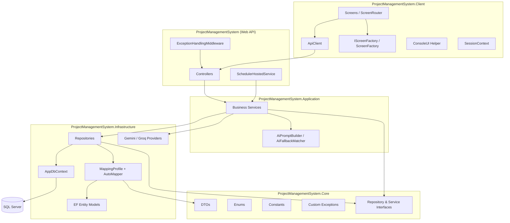
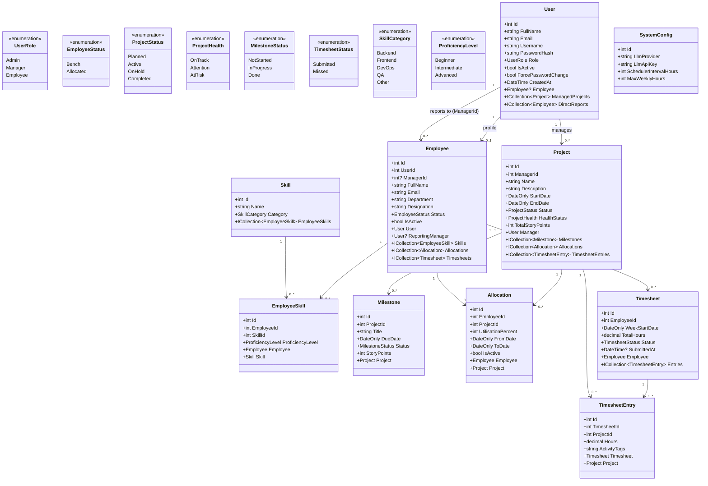
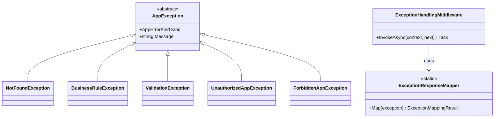

# PRM Tool — Class Diagram

> Rendered with [Mermaid](https://mermaid.js.org/). View in GitHub, VS Code (Markdown Preview Mermaid Support), or [mermaid.live](https://mermaid.live).

---

## 0. Solution Architecture



| Project | Responsibility |
|---|---|
| `ProjectManagementSystem.Client` | Console UI, JWT session, `ScreenFactory` navigation, HTTP calls via `ApiClient` |
| `ProjectManagementSystem` | ASP.NET Core Web API — controllers, exception middleware, hosted scheduler |
| `ProjectManagementSystem.Application` | Business services (`AuthService`, `ManagerService`, `AiService`, etc.) |
| `ProjectManagementSystem.Core` | DTOs, enums, constants, interfaces, custom exceptions (no EF dependencies) |
| `ProjectManagementSystem.Infrastructure` | EF Core models, repositories, AutoMapper profiles, AI provider adapters, migrations |
| `ProjectManagementSystem.Tests` | xUnit unit tests for Application services |

**DI composition root (`Program.cs`):** repositories and infrastructure wired in the API host; application services via `AddApplicationServices()`.

---

## 1. Domain Models (`Infrastructure/Models/`) & Enums (`Core/Enums/`)



> **BRD V4 additions:** `Employee.ManagerId` links an employee to their reporting manager (`User.Id`). `Project.TotalStoryPoints` is admin-set; `Milestone.StoryPoints` tracks per-deliverable estimates. `CompletedStoryPoints` is computed in DTOs from Done milestones.

---

## 2. AutoMapper Layer (`Infrastructure/Mapping/`)

```mermaid
classDiagram

    class MappingProfile {
        <<Profile>>
        +MappingProfile()
    }

    class IMapper {
        <<interface>>
        +Map~TDest~(source) TDest
        +Map~TDest~(source, dest) TDest
    }

    class UserRepository {
        -AppDbContext db
        -IMapper mapper
    }

    class EmployeeRepository {
        -AppDbContext db
        -IMapper mapper
    }

    class ProjectRepository {
        -AppDbContext db
        -IMapper mapper
    }

    class AllocationRepository {
        -AppDbContext db
        -IMapper mapper
    }

    class SkillRepository {
        -AppDbContext db
        -IMapper mapper
    }

    class TimesheetRepository {
        -AppDbContext db
        -IMapper mapper
    }

    class SystemConfigRepository {
        -AppDbContext db
        -IMapper mapper
    }

    MappingProfile ..> User : Entity ↔ DTO
    MappingProfile ..> Employee : Entity ↔ DTO
    MappingProfile ..> Project : Entity ↔ DTO + CompletedStoryPoints
    MappingProfile ..> Milestone : Entity ↔ DTO
    MappingProfile ..> Allocation : Entity ↔ DTO
    MappingProfile ..> EmployeeSkill : Entity ↔ DTO
    MappingProfile ..> SystemConfig : Entity ↔ DTO
    MappingProfile ..> Timesheet : Entity ↔ DTO

    UserRepository --> IMapper : uses
    EmployeeRepository --> IMapper : uses
    ProjectRepository --> IMapper : uses
    AllocationRepository --> IMapper : uses
    SkillRepository --> IMapper : uses
    TimesheetRepository --> IMapper : uses
    SystemConfigRepository --> IMapper : uses
```



**Registered in `Program.cs`:**

```csharp
builder.Services.AddAutoMapper(typeof(MappingProfile).Assembly);
```

**Key mappings:** enum-to-string for DTOs, navigation properties (`ManagerName`, `EmployeeName`, `ProjectName`, `SkillName`), `Create*Dto` / `Update*Dto` → entity with ignored navigations and defaults.

---

## 3. Repository Layer (`Infrastructure/Repositories/`)

Repositories return **DTOs** (not raw entities) via AutoMapper.

```mermaid
classDiagram

    class IUserRepository {
        <<interface>>
        +GetByIdAsync(id) Task~UserDto~
        +GetByUsernameAsync(username) Task~User~
        +GetAllAsync() Task~IEnumerable~UserDto~~
        +CreateAsync(dto, hash, forcePasswordChange) Task~UserDto~
        +UpdateAsync(user) Task
        +ExistsAsync(username, email) Task~bool~
    }

    class IEmployeeRepository {
        <<interface>>
        +GetByIdAsync(id) Task~EmployeeDto~
        +GetAllAsync() Task~IEnumerable~EmployeeDto~~
        +GetByUserIdAsync(userId) Task~EmployeeDto~
        +CreateProfileForUserAsync(userId, name, email) Task~EmployeeDto~
        +UpdateAsync(id, dto) Task~EmployeeDto~
        +DeactivateAsync(id) Task
        +SetStatusAsync(id, status) Task
        +AssignManagerAsync(employeeUserId, managerUserId) Task~EmployeeDto~
        +GetTeamAllocatableResourcesAsync(managerUserId) Task
        +IsOnManagerTeamAsync(managerUserId, employeeId) Task~bool~
        +GetTeamEmployeeIdsAsync(managerUserId) Task
    }

    class IProjectRepository {
        <<interface>>
        +GetByIdAsync(id) Task~ProjectDto~
        +GetAllAsync() Task~IEnumerable~ProjectDto~~
        +GetByManagerIdAsync(managerId) Task~IEnumerable~ProjectDto~~
        +GetWithMilestonesAsync(id) Task~Project~
        +CreateAsync(dto) Task~ProjectDto~
        +UpdateAsync(id, dto) Task
        +UpdateHealthStatusAsync(id, health) Task
        +GetActiveAsync() Task~IEnumerable~Project~~
    }

    class IAllocationRepository {
        <<interface>>
        +GetAllActiveAsync() Task~IEnumerable~AllocationDto~~
        +GetByEmployeeIdAsync(employeeId) Task~IEnumerable~AllocationDto~~
        +GetByProjectIdAsync(projectId) Task~IEnumerable~AllocationDto~~
        +GetByIdAsync(id) Task~AllocationDto~
        +CreateAsync(dto) Task~AllocationDto~
        +UpdateEndDateAsync(id, endDate) Task~AllocationDto~
        +GetEmployeeIdsAllocatedBetweenAsync(from, to) Task~IEnumerable~int~~
    }

    class ITimesheetRepository {
        <<interface>>
        +GetByIdAsync(id) Task~TimesheetDto~
        +GetByEmployeeIdAsync(employeeId) Task~IEnumerable~TimesheetDto~~
        +GetTeamTimesheetsAsync(managerId, weekStart) Task~IEnumerable~TimesheetDto~~
        +ExistsForEmployeeWeekAsync(employeeId, weekStart) Task~bool~
        +CreateAsync(timesheet) Task~TimesheetDto~
        +CreateMissedAsync(employeeId, weekStart) Task
    }

    class ISkillRepository {
        <<interface>>
        +GetSkillsByEmployeeAsync(employeeId) Task~IEnumerable~EmployeeSkillDto~~
        +AddSkillAsync(employeeId, dto) Task~EmployeeSkillDto~
        +UpdateSkillAsync(employeeId, skillId, dto) Task
        +RemoveSkillAsync(employeeId, skillId) Task
    }

    class ISystemConfigRepository {
        <<interface>>
        +GetAsync() Task~SystemConfigDto~
        +UpdateAsync(dto) Task
    }

    IUserRepository <|.. UserRepository
    IEmployeeRepository <|.. EmployeeRepository
    IProjectRepository <|.. ProjectRepository
    IAllocationRepository <|.. AllocationRepository
    ITimesheetRepository <|.. TimesheetRepository
    ISkillRepository <|.. SkillRepository
    ISystemConfigRepository <|.. SystemConfigRepository
```



---

## 4. Application Service Layer (`ProjectManagementSystem.Application/`)

```mermaid
classDiagram

    class IAuthService {
        <<interface>>
        +LoginAsync(request) Task~LoginResponseDto~
        +ChangePasswordAsync(userId, dto) Task
    }

    class IUserService {
        <<interface>>
        +GetAllAsync() Task~IEnumerable~UserDto~~
        +CreateAsync(dto) Task~UserDto~
        +ResetPasswordAsync(userId, dto) Task
        +DeactivateAsync(userId) Task
        +ReactivateAsync(userId) Task
    }

    class IEmployeeService {
        <<interface>>
        +GetAllAsync() Task~IEnumerable~EmployeeDto~~
        +UpdateAsync(id, dto) Task
        +DeactivateAsync(id) Task
        +AssignManagerAsync(dto) Task~EmployeeDto~
    }

    class IProjectService {
        <<interface>>
        +GetAllAsync() Task~IEnumerable~ProjectDto~~
        +GetByIdAsync(id) Task~ProjectDto~
        +CreateAsync(dto) Task~ProjectDto~
        +UpdateAsync(id, dto) Task
        +GetMilestonesAsync(projectId) Task~IEnumerable~MilestoneDto~~
        +AddMilestoneAsync(projectId, dto) Task
        +UpdateMilestoneStatusAsync(projectId, milestoneId, dto) Task
    }

    class IAllocationService {
        <<interface>>
        +GetAllActiveAsync() Task~IEnumerable~AllocationDto~~
        +GetByProjectIdAsync(projectId) Task~IEnumerable~AllocationDto~~
        +GetByIdAsync(id) Task~AllocationDto~
        +CreateAsync(dto, managerUserId) Task~AllocationDto~
        +EndAsync(id, endDate, managerUserId) Task
    }

    class ITimesheetService {
        <<interface>>
        +GetTeamTimesheetsAsync(managerId, weekStart) Task~ManagerTeamTimesheetDto~
        +GetTimesheetByIdAsync(id, managerId) Task~TimesheetDto~
    }

    class IManagerService {
        <<interface>>
        +GetResourceDashboardAsync(managerUserId) Task~ResourceDashboardDto~
        +GetEmployeeDetailAsync(id, managerUserId) Task~EmployeeDetailDto~
        +GetMyProjectsAsync(managerId) Task~IEnumerable~ProjectDto~~
        +GetProjectDetailAsync(managerId, projectId) Task~ProjectDetailDto~
        +GetAISkillMatchAsync(request, managerUserId) Task~AISkillMatchResultDto~
        +GetAIRiskSummaryAsync(request) Task~AIRiskSummaryResultDto~
    }

    class IAiService {
        <<interface>>
        +GetSkillMatchAsync(request, managerUserId) Task~AISkillMatchResultDto~
        +GetRiskSummaryAsync(request) Task~AIRiskSummaryResultDto~
    }

    class IEmployeePortalService {
        <<interface>>
        +GetReminderAsync(userId) Task~EmployeeReminderDto~
        +GetProfileAsync(userId) Task~EmployeeProfileDto~
        +GetSubmitContextAsync(userId, weekStart) Task~EmployeeSubmitContextDto~
        +SubmitTimesheetAsync(userId, dto) Task~TimesheetDto~
        +GetMyTimesheetsAsync(userId) Task~IEnumerable~TimesheetDto~~
        +GetMyTimesheetAsync(userId, id) Task~TimesheetDto~
    }

    class ISchedulerService {
        <<interface>>
        +RunScheduledTasksAsync(ct) Task
    }

    class ManagerService {
        -IEmployeeRepository employeeRepo
        -IAiService aiService
        +team-scoped queries via ManagerId
    }

    class AiService {
        -IAiProviderFactory providerFactory
        -SkillRequirementMatcher pre-filter
        -AiFallbackMatcher rule-based fallback
    }

    class UserService {
        +CreateAsync auto-creates Employee profile when role = Employee
    }

    class SchedulerHostedService {
        -IServiceScopeFactory scopeFactory
        +ExecuteAsync(stoppingToken) Task
    }

    IManagerService <|.. ManagerService
    IAiService <|.. AiService
    IUserService <|.. UserService
    ISchedulerService <|.. SchedulerService
    ManagerService --> IAiService
    SchedulerHostedService --> ISchedulerService : invokes via scope
```



---

## 5. Exception Handling (`Core/Exceptions/` + `Middleware/`)



---

## 6. API Controllers

```mermaid
classDiagram

    class AuthController {
        +POST /api/auth/login
        +POST /api/auth/signup → 403 Disabled
        +PUT /api/auth/change-password
    }

    class UsersController {
        <<Authorize Admin>>
        +GET/POST /api/users
        +PUT reset-password, deactivate, reactivate
    }

    class EmployeesController {
        <<Authorize Admin>>
        +GET /api/employees
        +PUT /api/employees/{id}
        +PUT /api/employees/assign-manager
        +PUT deactivate, skills CRUD
    }

    class ProjectsController {
        <<Authorize Admin>>
        +GET/POST/PUT /api/projects
        +milestones CRUD with story points
    }

    class AllocationsController {
        <<Authorize Admin>>
        +GET /api/allocations
    }

    class ConfigController {
        <<Authorize Admin>>
        +GET/PUT /api/config
    }

    class ManagerController {
        <<Authorize Manager>>
        +GET dashboard, employees/{id}
        +GET/POST projects, allocations
        +GET timesheets
        +POST ai/skill-match, ai/risk-summary
        +team + project ownership checks
    }

    class EmployeeController {
        <<Authorize Employee>>
        +GET reminder, allocations
        +GET/POST timesheets
    }

    ManagerController --> IManagerService
    ManagerController --> IAllocationService
    ManagerController --> ITimesheetService
    EmployeeController --> IEmployeePortalService
```

> **Note:** AI uses the **Strategy + Factory** adapter pattern (`IAiProvider` → Gemini/Groq). `AiService` pre-filters candidates by manager team, availability, and skill keywords; falls back to rule-based matching when LLM is unconfigured or fails (`UsedFallback` flag).

---

## 7. Console Client — Navigation (`ProjectManagementSystem.Client/`)

```mermaid
classDiagram

    class ApiClient {
        +LoginAsync()
        +ChangePasswordAsync()
        +Admin* / Manager* / Employee* methods
    }

    class SessionContext {
        +string JwtToken
        +int UserId
        +string FullName
        +UserRole Role
        +bool ForcePasswordChange
        +bool IsLoggedIn
    }

    class IScreenFactory {
        <<interface>>
        +CreateRoleMenu(role) IScreen
        +CreateAdminScreen(action) IScreen
        +CreateManagerScreen(action) IScreen
        +CreateEmployeeScreen(action) IScreen
    }

    class ScreenFactory {
        +CreateRoleMenu()
        +CreateAdminScreen()
        +CreateManagerScreen()
        +CreateEmployeeScreen()
    }

    class ScreenRouter {
        +RouteAsync() Task
    }

    class IScreen {
        <<interface>>
        +ShowAsync() Task
    }

    class StartScreen {
        +ShowAsync() Task
        Menu: Login, Exit only
    }

    class ChangePasswordScreen
    class AdminMenuScreen
    class ManagerMenuScreen
    class EmployeeMenuScreen

    class ManageEmployeesScreen {
        View, Update, Deactivate
        Manage Skills, Assign Manager
    }

    class ManageProjectsScreen
    class ViewAllocationsScreen
    class ManageUsersScreen
    class SystemConfigScreen
    class ManageSkillsScreen

    class ResourceDashboardScreen
    class AllocateResourceScreen
    class MyProjectsScreen
    class TimesheetManagerScreen
    class AiAssistantScreen

    class SubmitTimesheetScreen
    class ViewTimesheetsScreen
    class ViewMyAllocationsScreen

    IScreenFactory <|.. ScreenFactory
    ScreenFactory ..> IScreen : creates
    StartScreen --> ApiClient
    ScreenRouter --> IScreenFactory
    AdminMenuScreen --> IScreenFactory
    ManagerMenuScreen --> IScreenFactory
    EmployeeMenuScreen --> IScreenFactory
    StartScreen --> SessionContext
    ScreenRouter --> SessionContext
```



> **BRD V4:** No `SignUpScreen`. Self-registration removed from client; `POST /api/auth/signup` returns 403. Employee profiles are auto-created when Admin creates a user with role `Employee` via Manage Users.
