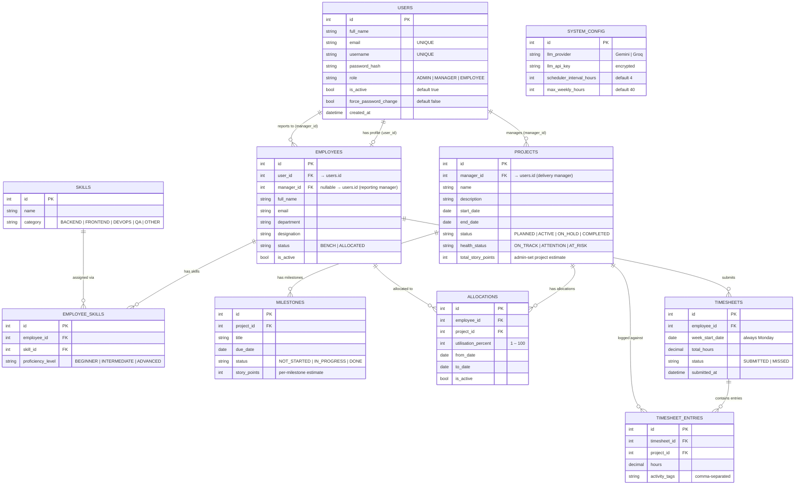

# PRM Tool — Entity Relationship (ER) Diagram




---

## Relationship Summary

| Relationship | Cardinality | Description |
|---|---|---|
| `USERS` → `EMPLOYEES` | 1 : 0..1 | One user may have one employee profile (Admin has none) |
| `USERS` → `EMPLOYEES` (manager) | 1 : 0..N | A Manager user is the reporting manager for zero or many employees (`manager_id`) |
| `USERS` → `PROJECTS` | 1 : 0..N | A Manager user owns zero or many projects |
| `EMPLOYEES` → `EMPLOYEE_SKILLS` | 1 : 0..N | An employee can hold multiple skills |
| `SKILLS` → `EMPLOYEE_SKILLS` | 1 : 0..N | A skill can be assigned to many employees |
| `PROJECTS` → `MILESTONES` | 1 : 0..N | A project has zero or many milestones (each with story points) |
| `PROJECTS` → `ALLOCATIONS` | 1 : 0..N | A project has zero or many allocations |
| `EMPLOYEES` → `ALLOCATIONS` | 1 : 0..N | An employee can be on multiple projects (sum ≤ 100%) |
| `EMPLOYEES` → `TIMESHEETS` | 1 : 0..N | An employee submits one timesheet per week |
| `TIMESHEETS` → `TIMESHEET_ENTRIES` | 1 : 1..N | Each timesheet has one entry per allocated project |
| `PROJECTS` → `TIMESHEET_ENTRIES` | 1 : 0..N | Hours are logged against a project |

---

## Key Business Constraints

```
ALLOCATIONS:
  SUM(utilisation_percent) for an employee
  across all overlapping date ranges  <=  100%
  Manager can only allocate employees where employee.manager_id = manager's user id

TIMESHEETS:
  hours per entry  <=  (allocation% x max_weekly_hours)
  SUM(hours) across all entries  <=  max_weekly_hours
  One timesheet per employee per week_start_date (unique constraint)
  Cannot submit for a future week

EMPLOYEES:
  status = BENCH      if no active allocation exists for today
  status = ALLOCATED  if at least one active allocation exists for today
  (recomputed by SchedulerHostedService every N hours)
  manager_id          nullable FK to users.id — set by Admin via Assign Manager
  Auto-created        when Admin creates a user with role EMPLOYEE

PROJECTS:
  total_story_points  admin-set at project creation
  completed_story_points (DTO) = SUM(milestone.story_points WHERE status = DONE)
  health_status = AT_RISK   if any milestone is IN_PROGRESS and overdue
  health_status = ATTENTION if any milestone is NOT_STARTED and due within 7 days
  health_status = ON_TRACK  otherwise
  (persisted by scheduler; ManagerService also computes live display health)

  Accounts created only by Admin
```

---

## Application Layer Mapping (AutoMapper)

Entity models in `Infrastructure/Models/` are mapped to DTOs in `Core/DTOs/` via `Infrastructure/Mapping/MappingProfile.cs`. Repositories inject `IMapper` and return DTOs to the Application service layer — the database schema above is unchanged; mapping is an application-layer concern only.

