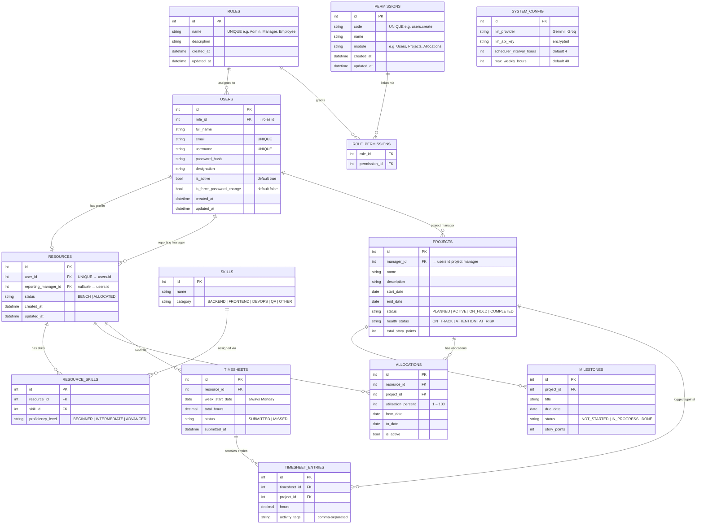
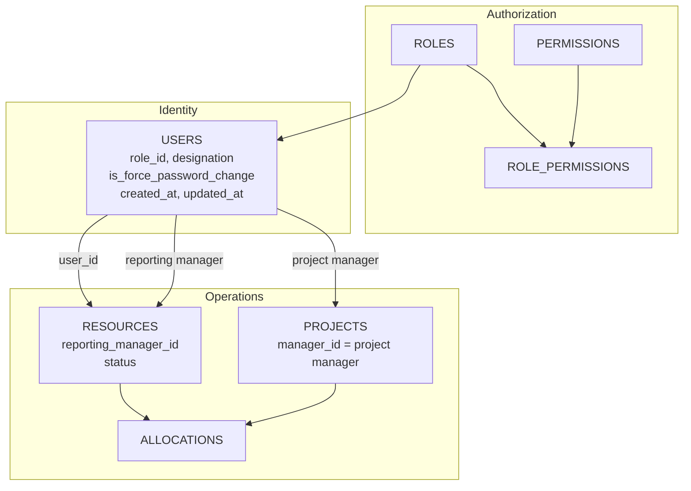

# PRM Tool — Proposed ER Diagram (Resources + RBAC Model)

> **Status:** Proposed / alternate schema — not implemented in the current codebase.  
> The live schema is documented in [ER_Diagram.md](./ER_Diagram.md).

This design renames `employees` to **`resources`**, normalizes identity on **`users`**, introduces **`roles`** and **`permissions`** (RBAC), and separates **reporting manager** (org hierarchy) from **project manager** (delivery ownership).

> Rendered with [Mermaid](https://mermaid.js.org/). View in GitHub, VS Code (Markdown Preview Mermaid Support), or [mermaid.live](https://mermaid.live).

---

## Design Goals

| Change | Rationale |
|---|---|
| `employees` → `resources` | Operational profile for allocatable people; identity on `users` |
| Remove `full_name`, `email`, `is_active` from resources | Single source of truth on `users` |
| `designation` on `users` | Job title is a person attribute, not allocation state |
| `roles` + `permissions` tables | Replace inline `role` enum; fine-grained access control |
| `is_force_password_change` on `users` | Renamed from `force_password_change` (C#: `IsForcePasswordChange`) |
| `created_at` + `updated_at` on `users` | Audit when account was created and last modified |
| `reporting_manager_id` on `resources` | Exactly **one** reporting manager per resource (org line) |
| `projects.manager_id` unchanged | **Project manager** can differ per project from reporting manager |

---

## Reporting Manager vs Project Manager

| Concept | Stored on | Cardinality | Meaning |
|---|---|---|---|
| **Reporting manager** | `resources.reporting_manager_id` → `users.id` | 1 per resource | Who the person reports to in the org (team lead) |
| **Project manager** | `projects.manager_id` → `users.id` | 1 per project | Who owns delivery for that project |

A resource may report to **Manager A** but be allocated to projects owned by **Manager B** and **Manager C**.

---

## Entity Relationship Diagram



---

## RBAC Model

### Seed roles

| `roles.name` | Typical permissions |
|---|---|
| **Admin** | Full system: users, resources, projects, config, all allocations |
| **Manager** | Team dashboard, allocate on owned projects, team timesheets, AI tools |
| **Employee** | Own allocations, submit/view own timesheets |

### Example permissions

| `permissions.code` | `module` | Description |
|---|---|---|
| `users.create` | Users | Create user accounts |
| `users.reset_password` | Users | Reset passwords |
| `resources.assign_reporting_manager` | Resources | Set `reporting_manager_id` |
| `projects.create` | Projects | Create projects |
| `allocations.create` | Allocations | Allocate resources to projects |
| `timesheets.view_team` | Timesheets | View direct reports' timesheets |
| `timesheets.submit_own` | Timesheets | Submit own timesheet |
| `config.update` | Config | Update system configuration |
| `ai.skill_match` | AI | Run AI skill match |
| `ai.risk_summary` | AI | Run AI risk summary |

### Authorization flow

```
Request → JWT → users.role_id → role_permissions → permissions.code
         → allow / deny endpoint or action
```

---

## Field Mapping: Current Schema → Proposed

### `users`

| Current | Proposed | Notes |
|---|---|---|
| `role` (string enum) | `role_id` FK → `roles` | Normalized RBAC |
| `force_password_change` | `is_force_password_change` | C# property: `IsForcePasswordChange` |
| — | `designation` | Moved from `employees` / `resources` |
| `created_at` | `created_at` | Unchanged |
| — | `updated_at` | Set on every profile/password/role update |

### `employees` → `resources`

| Current `employees` | Proposed `resources` | Notes |
|---|---|---|
| `id` | `id` | PK |
| `user_id` | `user_id` | UNIQUE FK |
| `full_name`, `email` | — | Read from `users` |
| `department` | — | Removed; use `roles` |
| `designation` | — | Moved to `users.designation` |
| `is_active` | — | Use `users.is_active` |
| `manager_id` | `reporting_manager_id` | Renamed; FK to `users.id`; max one per resource |
| `status` | `status` | BENCH / ALLOCATED |
| — | `created_at`, `updated_at` | Audit timestamps |

**Renamed child FKs:** `employee_id` → `resource_id` on `resource_skills`, `allocations`, `timesheets`.

---

## Relationship Summary

| Relationship | Cardinality | Description |
|---|---|---|
| `ROLES` → `USERS` | 1 : 0..N | Each user has exactly one role |
| `ROLES` ↔ `PERMISSIONS` | N : M | Via `role_permissions` |
| `USERS` → `RESOURCES` | 1 : 0..1 | One resource profile per user (Admin may have none) |
| `USERS` → `RESOURCES` (reporting) | 1 : 0..N | A manager user is reporting manager for many resources |
| `USERS` → `PROJECTS` | 1 : 0..N | Project manager per project (independent of reporting manager) |
| `RESOURCES` → `ALLOCATIONS` | 1 : 0..N | Resource on many projects |
| `PROJECTS` → `ALLOCATIONS` | 1 : 0..N | Project has many allocations |

**Constraint:** `resources.reporting_manager_id` is nullable but at most **one** value per resource row (single reporting manager).

---

## Role & Lifecycle Rules

```
Role assignment:
  users.role_id → roles.id
  Promotion (Employee → Manager): UPDATE users SET role_id = <ManagerRoleId>, updated_at = NOW()
  Permissions follow role via role_permissions — no hard-coded role strings in app code

Resource profile:
  Created when Admin creates a user with Employee role (or manually)
  reporting_manager_id set by Admin — must reference a user with Manager role

Reporting manager vs project manager:
  resources.reporting_manager_id  → org / team scoping (dashboard, team timesheets)
  projects.manager_id             → who can allocate on that project (may differ)

Deactivation:
  UPDATE users SET is_active = false, updated_at = NOW()
  Login blocked via users.is_active; resource row retained for history

Force password change:
  users.is_force_password_change = true on admin reset
  Cleared to false after successful change-password; updated_at refreshed

Display in UI:
  SELECT u.full_name, u.email, u.designation, r.name AS role,
         res.status, rm.full_name AS reporting_manager
  FROM users u
  JOIN roles r ON r.id = u.role_id
  LEFT JOIN resources res ON res.user_id = u.id
  LEFT JOIN users rm ON rm.id = res.reporting_manager_id
```

---

## Manager Scoping (Dual Model)

| Scope type | Driven by | Used for |
|---|---|---|
| **Team / org** | `resources.reporting_manager_id` | Resource dashboard, drill-down, team timesheets, AI candidate pool |
| **Project / delivery** | `projects.manager_id` | Create/end allocations, view project detail, project timesheets |

Example: Resource **Ravi** reports to **Manager A** (`reporting_manager_id`). Ravi is allocated to **Project X** (manager: **Manager B**) and **Project Y** (manager: **Manager A**). Manager A sees Ravi on team dashboard; Manager B can allocate/end Ravi only on Project X.

---

## Key Business Constraints

```
RBAC:
  users.role_id NOT NULL
  role_permissions PK (role_id, permission_id)
  permissions.code UNIQUE

USERS:
  is_force_password_change defaults to false
  updated_at set on create, update, password change, role change, deactivate/reactivate
  designation optional; can change when role changes (e.g. "Senior Developer" → "Delivery Manager")

RESOURCES:
  user_id UNIQUE — one resource row per user
  reporting_manager_id NULL or references users.id where role = Manager
  At most one reporting_manager_id per resource (column-level, not a junction table)
  status = BENCH | ALLOCATED (scheduler recomputes)

ALLOCATIONS:
  SUM(utilisation_percent) per resource across overlapping dates <= 100%
  Project manager (projects.manager_id) authorizes allocation on that project
  Reporting manager does not block allocation to another manager's project

TIMESHEETS:
  hours per entry <= allocation% x max_weekly_hours
  total hours <= max_weekly_hours
  one timesheet per resource per week_start_date
```

---

## Architecture Overview



---

## Comparison with Current Implemented Schema

| Area | Current (`ER_Diagram.md`) | Proposed (this document) |
|---|---|---|
| Role storage | `users.role` string enum | `roles` + `users.role_id` + `permissions` |
| Designation | `employees.designation` | `users.designation` |
| Reporting manager | `employees.manager_id` | `resources.reporting_manager_id` |
| Project manager | `projects.manager_id` | Same — separate from reporting manager |
| Password flag | `force_password_change` | `is_force_password_change` |
| Audit | `created_at` only on users | `created_at` + `updated_at` on users (and resources) |
| Table name | `employees` | `resources` |

---

## Related Documents

- [ER_Diagram.md](./ER_Diagram.md) — current implemented schema
- [UseCase_Diagram.md](./UseCase_Diagram.md) — current use cases (Assign Manager maps to `reporting_manager_id`)
- [PRM_BRD_V4.md](../ProblemStatement/PRM_BRD_V4.md) — current business requirements
