# PRM Tool — Sequence Diagrams

> Rendered with [Mermaid](https://mermaid.js.org/). View in GitHub, VS Code (Markdown Preview Mermaid Support), or [mermaid.live](https://mermaid.live).

---

## Table of Contents

1. [Login & Force Password Change](#1-login--force-password-change)
2. [Admin — Create User with Auto Employee Profile](#2-admin--create-user-with-auto-employee-profile)
3. [Admin — Assign Manager](#3-admin--assign-manager)
4. [Admin — Manage Employee Skills](#4-admin--manage-employee-skills)
5. [Admin — Create Project & Add Milestone](#5-admin--create-project--add-milestone)
6. [Manager — AI-Assisted Resource Allocation](#6-manager--ai-assisted-resource-allocation)
7. [Manager — Direct Allocation (Team Check)](#7-manager--direct-allocation-team-check)
8. [Manager — End an Allocation](#8-manager--end-an-allocation)
9. [Manager — View Project Health + AI Risk Summary](#9-manager--view-project-health--ai-risk-summary)
10. [Employee — Submit Timesheet](#10-employee--submit-timesheet)
11. [Background Scheduler — Auto Tasks](#11-background-scheduler--auto-tasks)
12. [Admin — System Configuration Update](#12-admin--system-configuration-update)
13. [Exception Handling Middleware](#13-exception-handling-middleware)
14. [Repository — Entity to DTO Mapping (AutoMapper)](#14-repository--entity-to-dto-mapping-automapper)

---

## 1. Login & Force Password Change

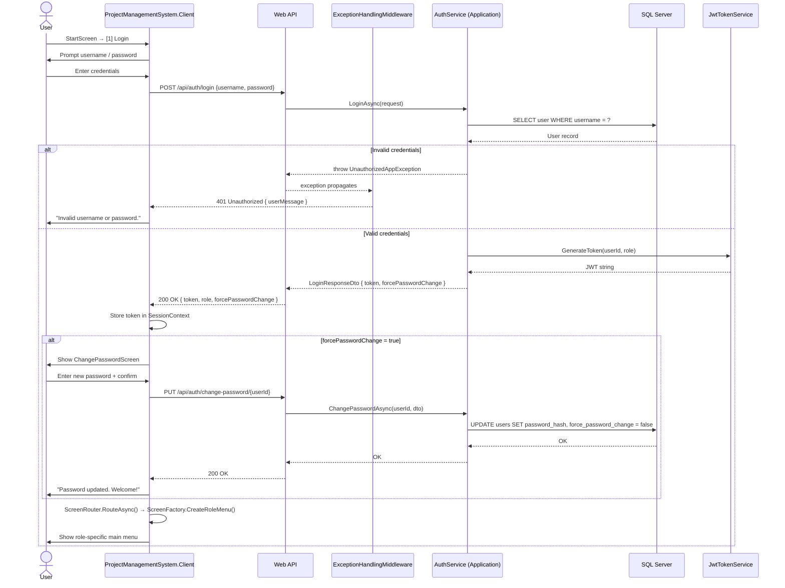

---

## 2. Admin — Create User with Auto Employee Profile

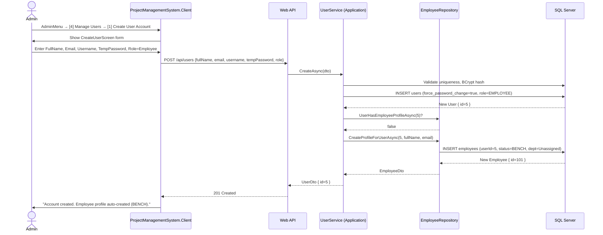

---

## 3. Admin — Assign Manager

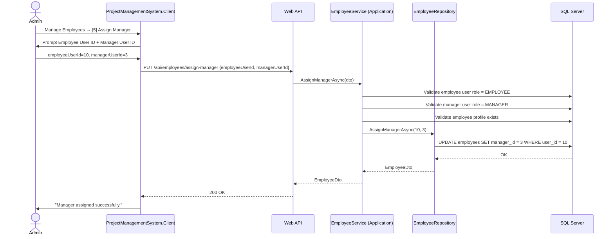

---

## 4. Admin — Manage Employee Skills

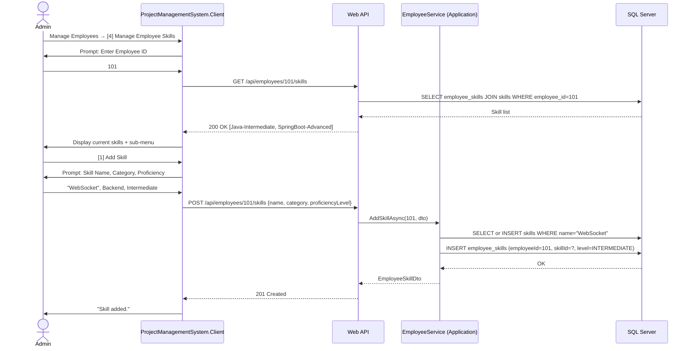

---

## 5. Admin — Create Project & Add Milestone

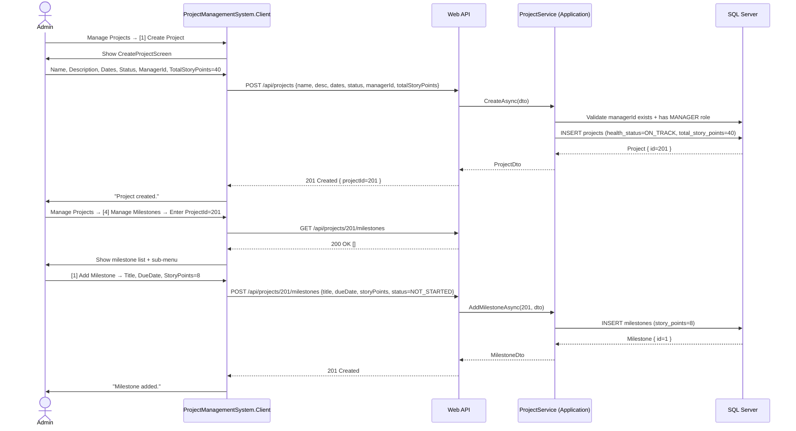

---

## 6. Manager — AI-Assisted Resource Allocation

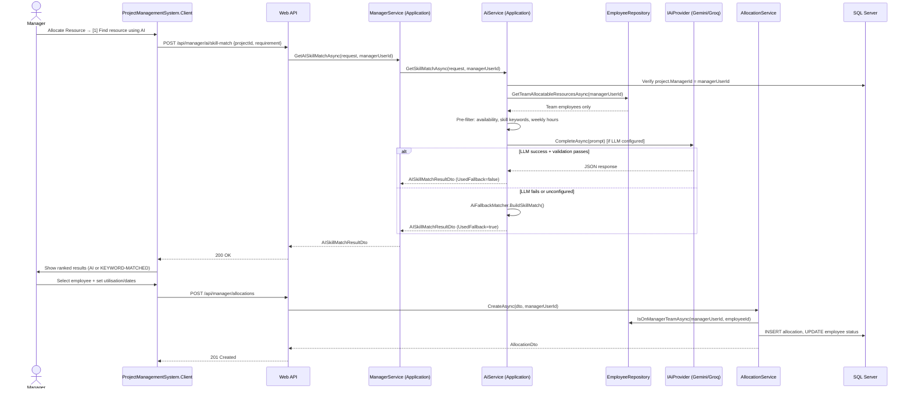

---

## 7. Manager — Direct Allocation (Team Check)

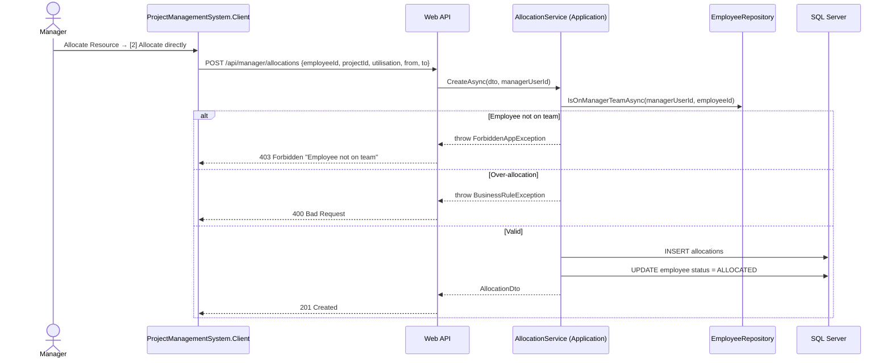

---

## 8. Manager — End an Allocation

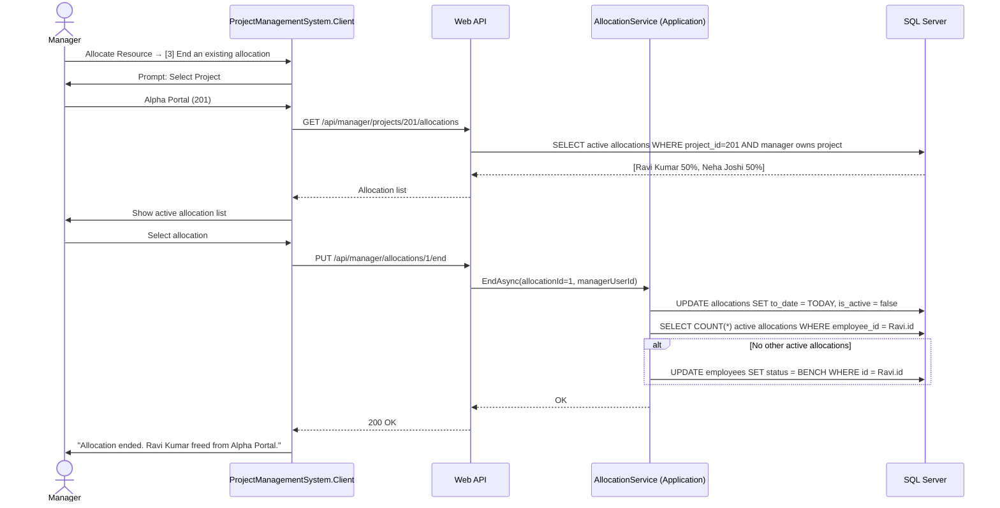

---

## 9. Manager — View Project Health + AI Risk Summary

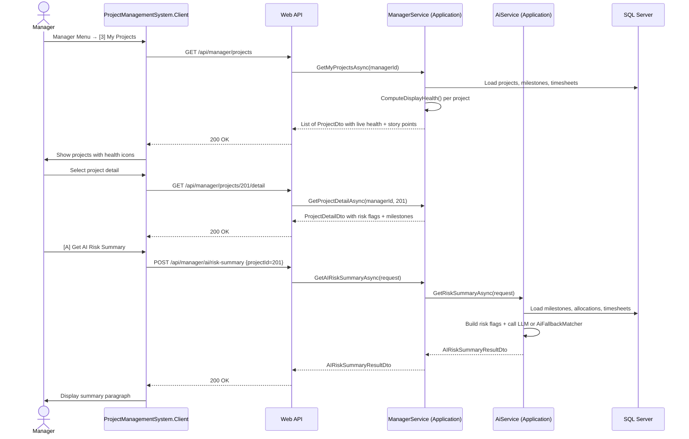

---

## 10. Employee — Submit Timesheet

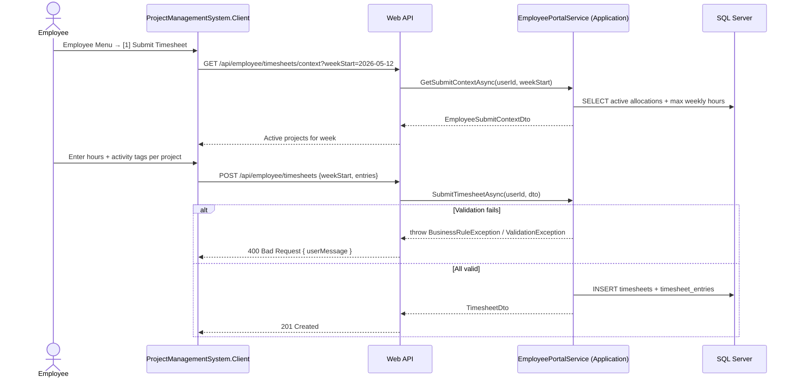

---

## 11. Background Scheduler — Auto Tasks

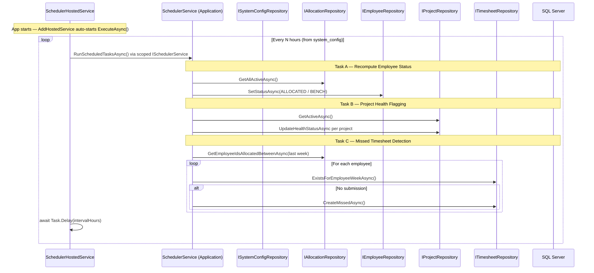

---

## 12. Admin — System Configuration Update

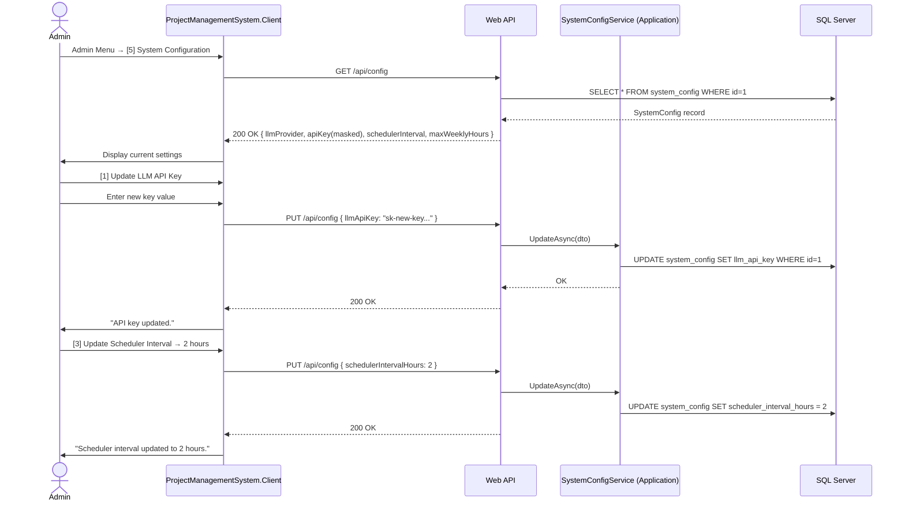

---

## 13. Exception Handling Middleware

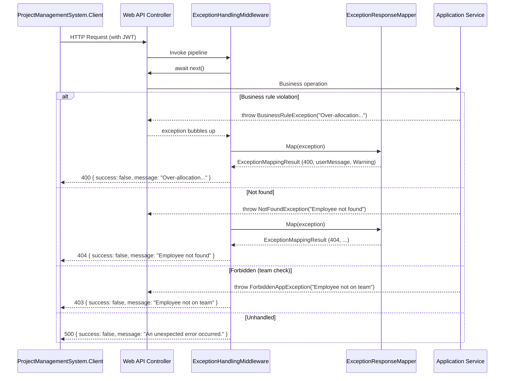

---

## 14. Repository — Entity to DTO Mapping (AutoMapper)

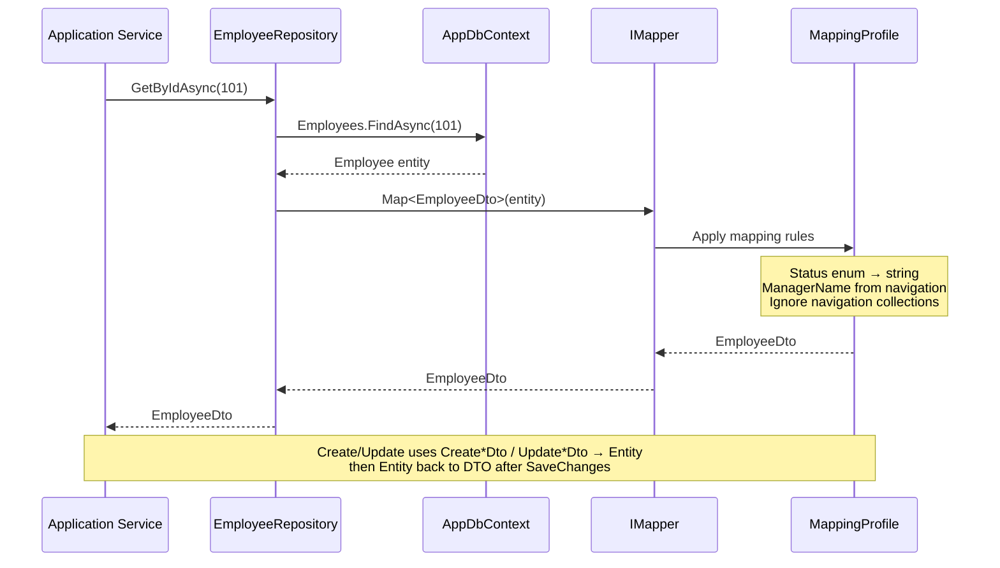

**DI registration:** `builder.Services.AddAutoMapper(typeof(MappingProfile).Assembly);`

**Composition root:** Repositories registered in `Program.cs`; application services via `AddApplicationServices()`.
